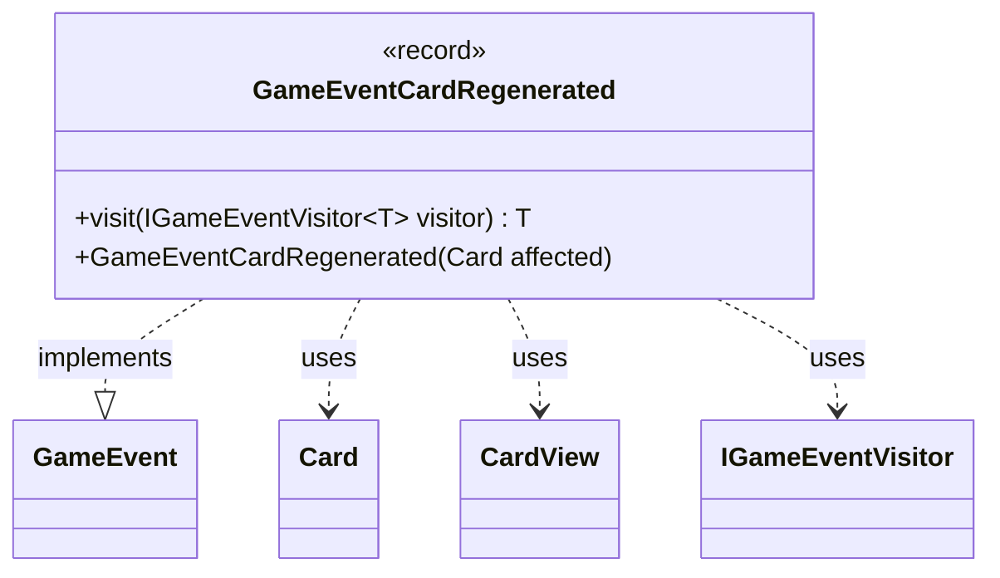

---
aliases:
  - GameEventCardRegenerated
tags:
  - java/record
  - module/forge-game
  - pkg/forge/game/event
fqn: forge.game.event.GameEventCardRegenerated
package: forge.game.event
module: forge-game
kind: Record
---

# GameEventCardRegenerated

**Package:** `forge.game.event` &nbsp; **Module:** `forge-game` &nbsp; **Kind:** Record



## Relationships
**Implements:**
- [[forge.game.event.GameEvent|GameEvent]]
**Uses:**
- [[forge.game.card.Card|Card]]
- [[forge.game.card.CardView|CardView]]
- [[forge.game.event.IGameEventVisitor|IGameEventVisitor]]

## Design Description

`GameEventCardRegenerated` is an immutable event record signaling that one or more cards have been regenerated during play. As a `GameEvent`, it participates in Forge's event-dispatch system: gameplay logic publishes it to notify observers—UI, logging, and AI—of the state change, decoupling the cause of regeneration from its consumers. It carries only a `Collection<CardView>`, the view-layer projection of the affected cards rather than live `Card` model objects, keeping the event lightweight and safe to hand to presentation code.

The record implements `visit` via the visitor pattern, dispatching to the type-specific overload on an `IGameEventVisitor<T>` so handlers can process events without instanceof checks. A convenience constructor accepts a single live `Card`, wrapping it through `CardView.get` into a singleton collection—a deliberate adaptation from the model side to the view-oriented event payload.

## Source
`forge-game/src/main/java/forge/game/event/GameEventCardRegenerated.java`

```java
package forge.game.event;

import forge.game.card.Card;
import forge.game.card.CardView;

import java.util.Collection;
import java.util.Collections;

public record GameEventCardRegenerated(Collection<CardView> cards) implements GameEvent {

    public GameEventCardRegenerated(Card affected) {
        this(Collections.singletonList(CardView.get(affected)));
    }

    @Override
    public <T> T visit(IGameEventVisitor<T> visitor) {
        return visitor.visit(this);
    }
}
```
