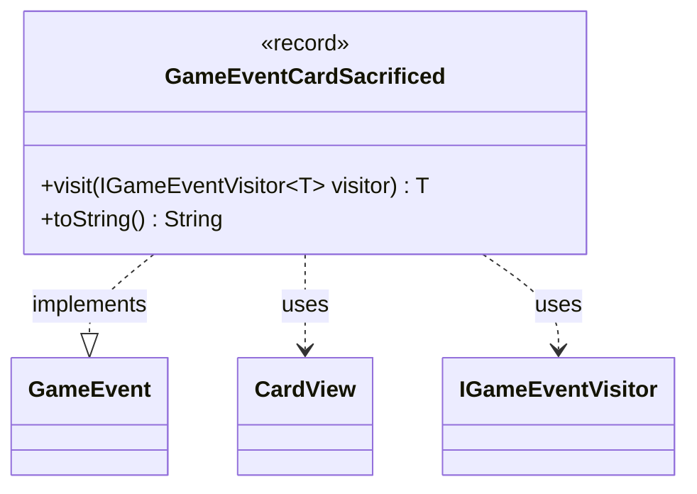

---
aliases:
  - GameEventCardSacrificed
tags:
  - java/record
  - module/forge-game
  - pkg/forge/game/event
fqn: forge.game.event.GameEventCardSacrificed
package: forge.game.event
module: forge-game
kind: Record
---

# GameEventCardSacrificed

**Package:** `forge.game.event` &nbsp; **Module:** `forge-game` &nbsp; **Kind:** Record



## Relationships
**Implements:**
- [[forge.game.event.GameEvent|GameEvent]]
**Uses:**
- [[forge.game.card.CardView|CardView]]
- [[forge.game.event.IGameEventVisitor|IGameEventVisitor]]

## Design Description

Records the sacrifice of a single card as an immutable game event. As a Java `record` implementing the `GameEvent` interface, it carries one `CardView` payload identifying the sacrificed card and participates in the event system's visitor pattern: its `visit` method dispatches to the appropriate `IGameEventVisitor` handler, letting observers react to sacrifices without the event itself knowing their concrete types. The overridden `toString` produces a human-readable summary—the card's controller followed by the sacrificed card—useful for logging and game-log display. The record form signals deliberate immutability and value semantics, fitting a fire-and-forget notification that should never be mutated after dispatch.

## Source
`forge-game/src/main/java/forge/game/event/GameEventCardSacrificed.java`

```java
package forge.game.event;

import forge.game.card.CardView;

public record GameEventCardSacrificed(CardView card) implements GameEvent {

    @Override
    public <T> T visit(IGameEventVisitor<T> visitor) {
        return visitor.visit(this);
    }

    /* (non-Javadoc)
     * @see java.lang.Object#toString()
     */
    @Override
    public String toString() {
        return "" + card.getController() + " sacrificed " + card;
    }
}
```
