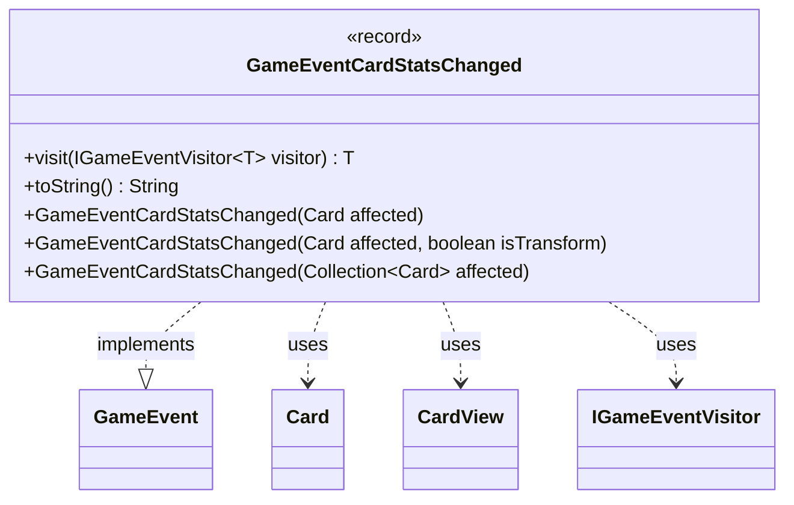

---
aliases:
  - GameEventCardStatsChanged
tags:
  - java/record
  - module/forge-game
  - pkg/forge/game/event
fqn: forge.game.event.GameEventCardStatsChanged
package: forge.game.event
module: forge-game
kind: Record
---

# GameEventCardStatsChanged

**Package:** `forge.game.event`   **Module:** `forge-game`   **Kind:** Record



## Relationships
**Implements:**
- [[forge.game.event.GameEvent|GameEvent]]
**Uses:**
- [[forge.game.card.Card|Card]]
- [[forge.game.card.CardView|CardView]]
- [[forge.game.event.IGameEventVisitor|IGameEventVisitor]]

## Design Description

`GameEventCardStatsChanged` is an immutable record-based notification signalling that a card's characteristics (type, power, toughness, transform state) have changed on the server, prompting clients to re-request the affected cards' current state. As an implementation of the `GameEvent` interface, it participates in the engine's visitor-based event dispatch: its `visit` method double-dispatches to an `IGameEventVisitor`, letting handlers react to stat changes without the event needing to know their concrete types.

Its design favors convenience and decoupling. Rather than retaining live `Card` model objects, the constructors eagerly translate one or many `Card` instances into a `Collection<CardView>` via `CardView.getCollection`, so the event carries only the client-facing view snapshot. Overloaded constructors accept a single card, a card with a transform flag, or a collection, while `toString` produces a human-readable summary—name, types, and P/T of the first card plus an "and N more" suffix—useful for logging and sound/UI triggers.

## Source
`forge-game/src/main/java/forge/game/event/GameEventCardStatsChanged.java`

```java
package forge.game.event;

import java.util.Arrays;
import java.util.Collection;

import com.google.common.collect.Iterables;
import org.apache.commons.lang3.StringUtils;

import forge.game.card.Card;
import forge.game.card.CardView;

/**
 * This means card's characteristics have changed on server, clients must re-request them
 */
public record GameEventCardStatsChanged(Collection<CardView> cards, boolean transform) implements GameEvent {

    public GameEventCardStatsChanged(Card affected) {
        this(affected, false);
    }

    public GameEventCardStatsChanged(Card affected, boolean isTransform) {
        this(CardView.getCollection(Arrays.asList(affected)), false);
        //the transform should only fire once so the flip effect sound will trigger once every transformation...
        // disable for now
    }

    public GameEventCardStatsChanged(Collection<Card> affected) {
        this(CardView.getCollection(affected), false);
    }

    /* (non-Javadoc)
     * @see forge.game.event.GameEvent#visit(forge.game.event.IGameEventVisitor)
     */
    @Override
    public <T> T visit(IGameEventVisitor<T> visitor) {
        return visitor.visit(this);
    }

    @Override
    public String toString() {
        CardView card = Iterables.getFirst(cards, null);
        if (null == card)
            return "Card state changes: (empty list)";
        if (cards.size() == 1)
            return "Card state changes: " + card.getName() +
                  " (" + StringUtils.join(card.getCurrentState().getType(), ' ') + ") " +
                  card.getCurrentState().getPower() + "/" + card.getCurrentState().getToughness();
        else
            return "Card state changes: " + card.getName() +
                  " (" + StringUtils.join(card.getCurrentState().getType(), ' ') + ") " +
                  card.getCurrentState().getPower() + "/" + card.getCurrentState().getToughness() +
                  " and " + (cards.size() - 1) + " more";
    }

}
```

## Python
`forge/game/event/GameEventCardStatsChanged.py`

```python
package forge.game.event

from typing import TypeVar, Generic

from forge.game.event.GameEvent import GameEvent
from forge.game.card.Card import Card
from forge.game.card.CardView import CardView
from forge.game.event.IGameEventVisitor import IGameEventVisitor

T = TypeVar("T")


class GameEventCardStatsChanged(GameEvent):

    def __init__(self, affected=None, isTransform=False, cards=None, transform=False):
        if cards is not None:
            self.cards = cards
            self.transform = transform
        elif isinstance(affected, Card):
            self.cards = CardView.getCollection([affected])
            self.transform = False
        else:
            self.cards = CardView.getCollection(affected)
            self.transform = False

    def visit(self, visitor):
        return visitor.visit(self)

    def __str__(self):
        card = next(iter(self.cards), None)
        if card is None:
            return "Card state changes: (empty list)"
        if len(self.cards) == 1:
            return ("Card state changes: " + card.getName() +
                    " (" + " ".join(card.getCurrentState().getType()) + ") " +
                    str(card.getCurrentState().getPower()) + "/" + str(card.getCurrentState().getToughness()))
        else:
            return ("Card state changes: " + card.getName() +
                    " (" + " ".join(card.getCurrentState().getType()) + ") " +
                    str(card.getCurrentState().getPower()) + "/" + str(card.getCurrentState().getToughness()) +
                    " and " + str(len(self.cards) - 1) + " more")

    def toString(self):
        return self.__str__()
```
