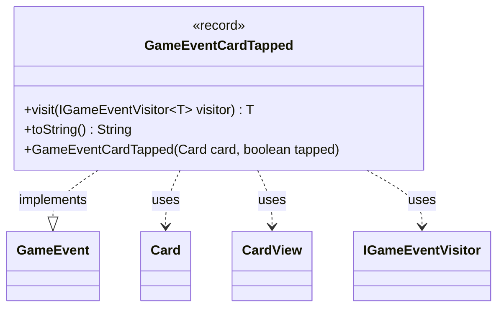

---
aliases:
  - GameEventCardTapped
tags:
  - java/record
  - module/forge-game
  - pkg/forge/game/event
fqn: forge.game.event.GameEventCardTapped
package: forge.game.event
module: forge-game
kind: Record
---

# GameEventCardTapped

**Package:** `forge.game.event` &nbsp; **Module:** `forge-game` &nbsp; **Kind:** Record



## Relationships
**Implements:**
- [[forge.game.event.GameEvent|GameEvent]]
**Uses:**
- [[forge.game.card.Card|Card]]
- [[forge.game.card.CardView|CardView]]
- [[forge.game.event.IGameEventVisitor|IGameEventVisitor]]

## Design Description

The class `GameEventCardTapped` is an immutable record in the `forge.game.event` package that signals a single state change in the game model: a card has been tapped or untapped. It packages the affected card together with a boolean indicating its new tapped state, serving as a lightweight, immutable notification passed through Forge's game-event system.

As an implementation of the `GameEvent` interface, it participates in a visitor-pattern dispatch mechanism: its `visit` method forwards to the appropriate overload on an `IGameEventVisitor`, letting observers handle each event type without instanceof checks. Notably, the convenience constructor accepts a domain `Card` but stores only its `CardView`, decoupling event consumers (typically the UI) from the mutable model and exposing only a safe, read-only projection. The `toString` override yields a concise human-readable summary for logging.

## Source
`forge-game/src/main/java/forge/game/event/GameEventCardTapped.java`

```java
package forge.game.event;

import forge.game.card.Card;
import forge.game.card.CardView;

public record GameEventCardTapped(CardView card, boolean tapped) implements GameEvent {

    public GameEventCardTapped(Card card, boolean tapped) {
        this(CardView.get(card), tapped);
    }

    @Override
    public <T> T visit(IGameEventVisitor<T> visitor) {
        return visitor.visit(this);
    }

    /* (non-Javadoc)
     * @see java.lang.Object#toString()
     */
    @Override
    public String toString() {
        return "" + card.getController() + (tapped ? " tapped " : " untapped ") + card;
    }
}
```

## Python
`forge/game/event/GameEventCardTapped.py`

```python
from typing import TypeVar

from forge.game.card.Card import Card
from forge.game.card.CardView import CardView
from forge.game.event.GameEvent import GameEvent
from forge.game.event.IGameEventVisitor import IGameEventVisitor

T = TypeVar("T")


class GameEventCardTapped(GameEvent):

    def __init__(self, card, tapped: bool):
        # Convenience constructor accepts a domain Card but stores only its CardView,
        # decoupling event consumers from the mutable model.
        if isinstance(card, Card):
            self.card: CardView = CardView.get(card)
        else:
            self.card: CardView = card
        self.tapped: bool = tapped

    def visit(self, visitor: IGameEventVisitor[T]) -> T:
        return visitor.visit(self)

    # (non-Javadoc)
    # @see java.lang.Object#toString()
    def toString(self) -> str:
        return "" + str(self.card.getController()) + (" tapped " if self.tapped else " untapped ") + str(self.card)

    def __str__(self) -> str:
        return self.toString()
```
