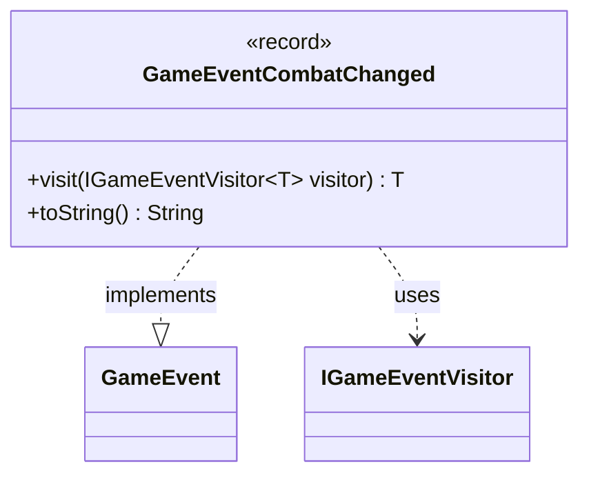

---
aliases:
  - GameEventCombatChanged
tags:
  - java/record
  - module/forge-game
  - pkg/forge/game/event
fqn: forge.game.event.GameEventCombatChanged
package: forge.game.event
module: forge-game
kind: Record
---

# GameEventCombatChanged

**Package:** `forge.game.event` &nbsp; **Module:** `forge-game` &nbsp; **Kind:** Record



## Relationships
**Implements:**
- [[forge.game.event.GameEvent|GameEvent]]
**Uses:**
- [[forge.game.event.IGameEventVisitor|IGameEventVisitor]]

## Design Description

GameEventCombatChanged is an immutable, parameterless event record signaling that the state of combat has changed during a game. As a record with no components, it carries no payload—its mere occurrence is the notification, suitable for prompting observers to refresh any combat-derived view or state.

By implementing `GameEvent`, it participates in the engine's event-dispatch mechanism and adopts the visitor pattern: its `visit` method dispatches to the appropriate overload on a supplied `IGameEventVisitor<T>`, letting handlers respond in a type-safe, generic manner without the event knowing their concrete logic. The overridden `toString` returns a fixed human-readable label, "Combat changed," aiding logging and debugging. This design keeps the event a lightweight, type-identity-based signal within the broader `forge.game.event` family of double-dispatch game notifications.

## Source
`forge-game/src/main/java/forge/game/event/GameEventCombatChanged.java`

```java
package forge.game.event;

public record GameEventCombatChanged() implements GameEvent {

    @Override
    public <T> T visit(IGameEventVisitor<T> visitor) {
        return visitor.visit(this);
    }

    /* (non-Javadoc)
     * @see java.lang.Object#toString()
     */
    @Override
    public String toString() {
        return "Combat changed";
    }
}
```
