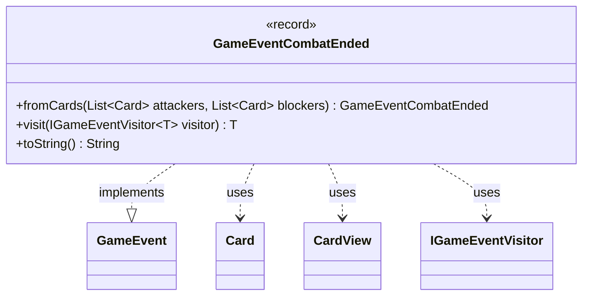

---
aliases:
  - GameEventCombatEnded
tags:
  - java/record
  - module/forge-game
  - pkg/forge/game/event
fqn: forge.game.event.GameEventCombatEnded
package: forge.game.event
module: forge-game
kind: Record
---

# GameEventCombatEnded

**Package:** `forge.game.event` &nbsp; **Module:** `forge-game` &nbsp; **Kind:** Record



## Relationships
**Implements:**
- [[forge.game.event.GameEvent|GameEvent]]
**Uses:**
- [[forge.game.card.Card|Card]]
- [[forge.game.card.CardView|CardView]]
- [[forge.game.event.IGameEventVisitor|IGameEventVisitor]]

## Design Description

GameEventCombatEnded is an immutable record that signals the conclusion of a combat phase within Forge's game-event system. It carries the attackers and blockers involved in the just-ended combat as lists of `CardView` objects—presentation-layer snapshots rather than live `Card` instances—so that event consumers receive decoupled, view-safe data.

As an implementation of the `GameEvent` interface, it participates in the visitor-based dispatch pattern: its `visit` method forwards to the appropriate `IGameEventVisitor` overload, letting observers handle the event without type-checking. The static `fromCards` factory adapts live `Card` lists into `CardView` lists, centralizing the model-to-view conversion (and tolerating null inputs) at the event's construction boundary. A descriptive `toString` aids logging and debugging.

## Source
`forge-game/src/main/java/forge/game/event/GameEventCombatEnded.java`

```java
package forge.game.event;

import java.util.List;
import java.util.stream.Collectors;

import forge.game.card.Card;
import forge.game.card.CardView;

public record GameEventCombatEnded(List<CardView> attackers, List<CardView> blockers) implements GameEvent {

    public static GameEventCombatEnded fromCards(List<Card> attackers, List<Card> blockers) {
        return new GameEventCombatEnded(
            attackers == null ? null : attackers.stream().map(CardView::get).collect(Collectors.toList()),
            blockers == null ? null : blockers.stream().map(CardView::get).collect(Collectors.toList())
        );
    }

    @Override
    public <T> T visit(IGameEventVisitor<T> visitor) {
        return visitor.visit(this);
    }

    /* (non-Javadoc)
     * @see java.lang.Object#toString()
     */
    @Override
    public String toString() {
        return "Combat ended. Attackers: " + attackers + " Blockers: " + blockers;
    }
}
```
