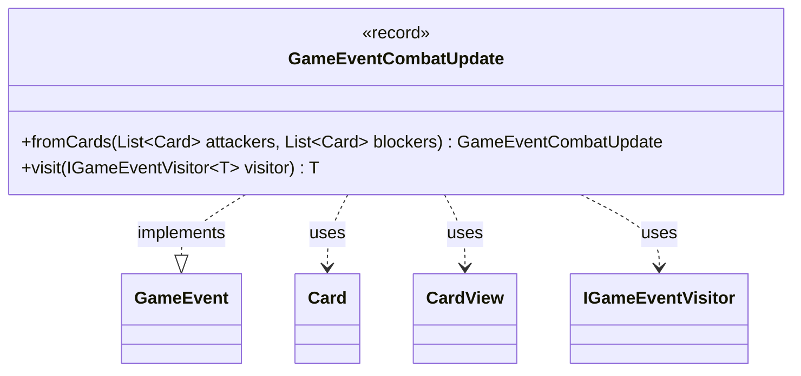

---
aliases:
  - GameEventCombatUpdate
tags:
  - java/record
  - module/forge-game
  - pkg/forge/game/event
fqn: forge.game.event.GameEventCombatUpdate
package: forge.game.event
module: forge-game
kind: Record
---

# GameEventCombatUpdate

**Package:** `forge.game.event` &nbsp; **Module:** `forge-game` &nbsp; **Kind:** Record



## Relationships
**Implements:**
- [[forge.game.event.GameEvent|GameEvent]]
**Uses:**
- [[forge.game.card.Card|Card]]
- [[forge.game.card.CardView|CardView]]
- [[forge.game.event.IGameEventVisitor|IGameEventVisitor]]

## Design Description

`GameEventCombatUpdate` is an immutable record that signals a change in the combat state—the current sets of attackers and blockers—so observers can refresh their view of the board. It implements the `GameEvent` interface, participating in the engine's event system, and supports the visitor pattern through its `visit` method, which dispatches to an `IGameEventVisitor` for type-safe, double-dispatch handling alongside other game events.

The record stores its participants as presentation-friendly `CardView` lists rather than live `Card` model objects, deliberately decoupling the event from mutable game state and making it safe to hand to the UI layer. The static `fromCards` factory bridges this gap, converting raw `Card` collections into `CardView` instances while null-tolerantly preserving absent attacker or blocker lists.

## Source
`forge-game/src/main/java/forge/game/event/GameEventCombatUpdate.java`

```java
package forge.game.event;

import java.util.List;
import java.util.stream.Collectors;

import forge.game.card.Card;
import forge.game.card.CardView;

public record GameEventCombatUpdate(List<CardView> attackers, List<CardView> blockers) implements GameEvent {

    public static GameEventCombatUpdate fromCards(List<Card> attackers, List<Card> blockers) {
        return new GameEventCombatUpdate(
            attackers == null ? null : attackers.stream().map(CardView::get).collect(Collectors.toList()),
            blockers == null ? null : blockers.stream().map(CardView::get).collect(Collectors.toList())
        );
    }

    @Override
    public <T> T visit(IGameEventVisitor<T> visitor) {
        return visitor.visit(this);
    }

}
```
