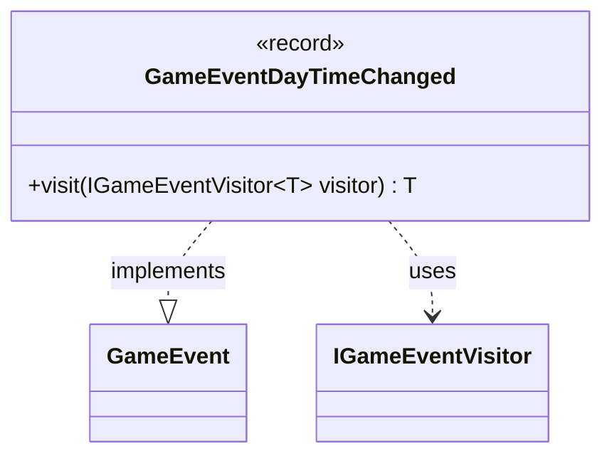

---
aliases:
  - GameEventDayTimeChanged
tags:
  - java/record
  - module/forge-game
  - pkg/forge/game/event
fqn: forge.game.event.GameEventDayTimeChanged
package: forge.game.event
module: forge-game
kind: Record
---

# GameEventDayTimeChanged

**Package:** `forge.game.event` &nbsp; **Module:** `forge-game` &nbsp; **Kind:** Record



## Relationships
**Implements:**
- [[forge.game.event.GameEvent|GameEvent]]
**Uses:**
- [[forge.game.event.IGameEventVisitor|IGameEventVisitor]]

## Design Description

`GameEventDayTimeChanged` is an immutable record that signals a transition in the game's day/night cycle, carrying a single `daytime` flag indicating whether it is now day. As a concrete implementation of the `GameEvent` interface, it participates in the engine's event-notification system, allowing day-time changes to be broadcast to interested observers without coupling them to game internals.

The record follows the visitor pattern: its `visit` method dispatches to the appropriate overload on a generic `IGameEventVisitor<T>`, delegating handling to the visitor and returning the visitor's typed result. This double-dispatch design keeps event objects as lightweight, behavior-free data carriers while letting each visitor implementation decide how to react, and the record form guarantees the event is a compact, immutable value safe to publish across subsystems.

## Source
`forge-game/src/main/java/forge/game/event/GameEventDayTimeChanged.java`

```java
package forge.game.event;

public record GameEventDayTimeChanged(boolean daytime) implements GameEvent {

    @Override
    public <T> T visit(IGameEventVisitor<T> visitor) {
        return visitor.visit(this);
    }
}
```
