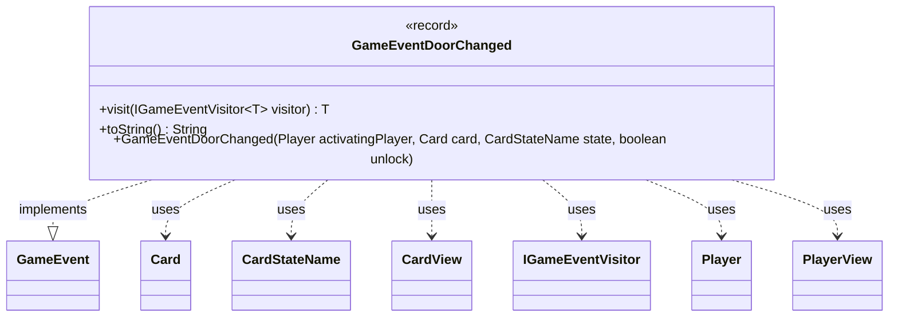

---
aliases:
  - GameEventDoorChanged
tags:
  - java/record
  - module/forge-game
  - pkg/forge/game/event
fqn: forge.game.event.GameEventDoorChanged
package: forge.game.event
module: forge-game
kind: Record
---

# GameEventDoorChanged

**Package:** `forge.game.event`   **Module:** `forge-game`   **Kind:** Record



## Relationships
**Implements:**
- [[forge.game.event.GameEvent|GameEvent]]
**Uses:**
- [[forge.card.CardStateName|CardStateName]]
- [[forge.game.card.Card|Card]]
- [[forge.game.card.CardView|CardView]]
- [[forge.game.event.IGameEventVisitor|IGameEventVisitor]]
- [[forge.game.player.Player|Player]]
- [[forge.game.player.PlayerView|PlayerView]]

## Design Description

GameEventDoorChanged is an immutable record that signals a door on a room/battle Card being locked or unlocked—the event fired when a player toggles a door's state. As a `GameEvent` implementation, it participates in Forge's double-dispatch event system: its `visit` method routes to the appropriate `IGameEventVisitor` handler, decoupling event production from the UI and logging consumers that react to it. Notably, the convenience constructor accepts live model objects (`Player`, `Card`) but immediately converts them to their view counterparts (`PlayerView`, `CardView`), so the stored payload carries only presentation-safe snapshots rather than mutable game state—a deliberate separation between the game model and observers. Its `toString` renders a human-readable message (e.g., a player locking or unlocking the named door) using `Lang` for possessive phrasing.

## Source
`forge-game/src/main/java/forge/game/event/GameEventDoorChanged.java`

```java
package forge.game.event;

import forge.card.CardStateName;
import forge.game.card.Card;
import forge.game.card.CardView;
import forge.game.player.Player;
import forge.game.player.PlayerView;
import forge.util.Lang;

public record GameEventDoorChanged(PlayerView activatingPlayer, CardView card, CardStateName state, boolean unlock) implements GameEvent {

    public GameEventDoorChanged(Player activatingPlayer, Card card, CardStateName state, boolean unlock) {
        this(PlayerView.get(activatingPlayer), CardView.get(card), state, unlock);
    }

    @Override
    public <T> T visit(IGameEventVisitor<T> visitor) {
        return visitor.visit(this);
    }

    @Override
    public String toString() {
        String doorName = card.getCurrentState().getName();

        StringBuilder sb = new StringBuilder();
        sb.append(activatingPlayer);
        sb.append(" ");
        sb.append(unlock ? "unlocks" : "locks");
        sb.append(" ");
        sb.append(Lang.getInstance().getPossessedObject(doorName, "Door"));
        return sb.toString();
    }
}
```

## Python
`forge/game/event/GameEventDoorChanged.py`

```python
from forge.card.CardStateName import CardStateName
from forge.game.card.Card import Card
from forge.game.card.CardView import CardView
from forge.game.event.GameEvent import GameEvent
from forge.game.event.IGameEventVisitor import IGameEventVisitor
from forge.game.player.Player import Player
from forge.game.player.PlayerView import PlayerView
from forge.util.Lang import Lang


class GameEventDoorChanged(GameEvent):

    def __init__(self, activatingPlayer, card, state: CardStateName, unlock: bool):
        if isinstance(activatingPlayer, Player):
            self.activatingPlayer = PlayerView.get(activatingPlayer)
        else:
            self.activatingPlayer = activatingPlayer
        if isinstance(card, Card):
            self.card = CardView.get(card)
        else:
            self.card = card
        self.state = state
        self.unlock = unlock

    def visit(self, visitor: IGameEventVisitor):
        return visitor.visit(self)

    def __str__(self) -> str:
        doorName = self.card.getCurrentState().getName()

        sb = []
        sb.append(str(self.activatingPlayer))
        sb.append(" ")
        sb.append("unlocks" if self.unlock else "locks")
        sb.append(" ")
        sb.append(Lang.getInstance().getPossessedObject(doorName, "Door"))
        return "".join(sb)
```
