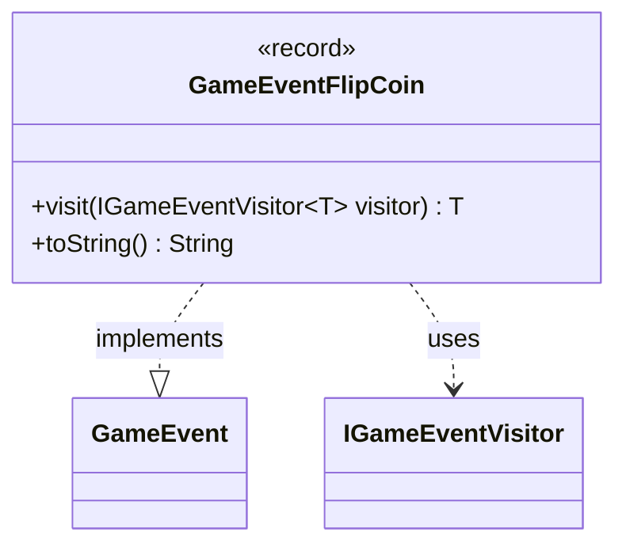

---
aliases:
  - GameEventFlipCoin
tags:
  - java/record
  - module/forge-game
  - pkg/forge/game/event
fqn: forge.game.event.GameEventFlipCoin
package: forge.game.event
module: forge-game
kind: Record
---

# GameEventFlipCoin

**Package:** `forge.game.event`   **Module:** `forge-game`   **Kind:** Record



## Relationships
**Implements:**
- [[forge.game.event.GameEvent|GameEvent]]
**Uses:**
- [[forge.game.event.IGameEventVisitor|IGameEventVisitor]]

## Design Description

Coin-flip notification event in Forge's game-event system. As a parameterless record implementing the `GameEvent` interface, it carries no state—its mere occurrence is the message, signaling that a coin flip happened during play. It participates in a visitor pattern: `visit` dispatches to the appropriate `IGameEventVisitor<T>` handler via double dispatch, letting observers (UI, AI, logging) react without the event itself knowing their concrete types. The overridden `toString` yields a fixed human-readable label, "Flipped coin." Using a record makes the type concise and immutable by design, and the empty parameter list reflects that the event needs no payload to convey its meaning to subscribers.

## Source
`forge-game/src/main/java/forge/game/event/GameEventFlipCoin.java`

```java
package forge.game.event;

public record GameEventFlipCoin() implements GameEvent {

    @Override
    public <T> T visit(IGameEventVisitor<T> visitor) {
        return visitor.visit(this);
    }

    /* (non-Javadoc)
     * @see java.lang.Object#toString()
     */
    @Override
    public String toString() {
        return "Flipped coin";
    }
}
```

## Python
`forge/game/event/GameEventFlipCoin.py`

```python
from forge.game.event.GameEvent import GameEvent
from forge.game.event.IGameEventVisitor import IGameEventVisitor


class GameEventFlipCoin(GameEvent):

    def visit(self, visitor: IGameEventVisitor):
        return visitor.visit(self)

    def __eq__(self, other):
        return isinstance(other, GameEventFlipCoin)

    def __hash__(self):
        return hash(GameEventFlipCoin)

    def toString(self) -> str:
        return "Flipped coin"

    def __str__(self) -> str:
        return self.toString()
```
