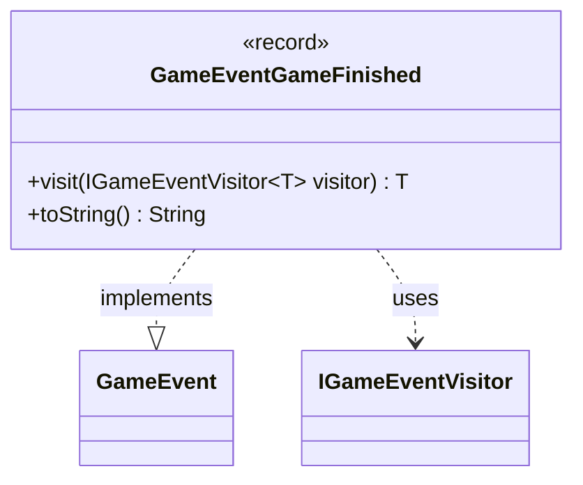

---
aliases:
  - GameEventGameFinished
tags:
  - java/record
  - module/forge-game
  - pkg/forge/game/event
fqn: forge.game.event.GameEventGameFinished
package: forge.game.event
module: forge-game
kind: Record
---

# GameEventGameFinished

**Package:** `forge.game.event` &nbsp; **Module:** `forge-game` &nbsp; **Kind:** Record



## Relationships
**Implements:**
- [[forge.game.event.GameEvent|GameEvent]]
**Uses:**
- [[forge.game.event.IGameEventVisitor|IGameEventVisitor]]

## Design Description

A record representing the terminal event in a game's lifecycle, signaling that play has concluded. As a parameterless record it carries no state — its existence in the event stream is the entire payload, making it a lightweight, immutable notification.

It implements the `GameEvent` interface and participates in the visitor pattern via the generic `visit` method, dispatching to `IGameEventVisitor.visit(this)` so that handlers can supply type-specific return values without the event itself knowing its consumers. The overridden `toString` yields a fixed human-readable label, "Game finished," useful for logging. A telling source comment notes the class must fire after the game log is assembled from prior events, revealing its intended ordering as a final, post-processing signal in the event sequence.

## Source
`forge-game/src/main/java/forge/game/event/GameEventGameFinished.java`

```java
package forge.game.event;

public record GameEventGameFinished() implements GameEvent {

    @Override
    public <T> T visit(IGameEventVisitor<T> visitor) {
        return visitor.visit(this);
    }

    /* (non-Javadoc)
     * @see java.lang.Object#toString()
     */
    @Override
    public String toString() {
        return "Game finished";
    }
} // need this class to launch after log was built via previous event
```
