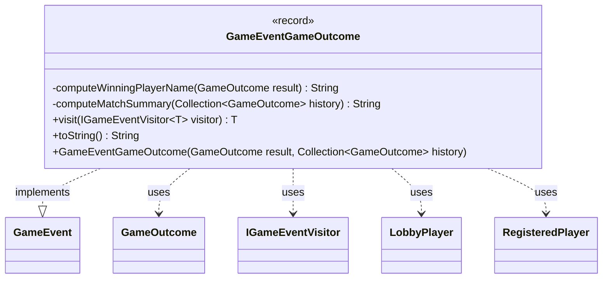

---
aliases:
  - GameEventGameOutcome
tags:
  - java/record
  - module/forge-game
  - pkg/forge/game/event
fqn: forge.game.event.GameEventGameOutcome
package: forge.game.event
module: forge-game
kind: Record
---

# GameEventGameOutcome

**Package:** `forge.game.event` &nbsp; **Module:** `forge-game` &nbsp; **Kind:** Record



## Relationships
**Implements:**
- [[forge.game.event.GameEvent|GameEvent]]
**Uses:**
- [[forge.LobbyPlayer|LobbyPlayer]]
- [[forge.game.GameOutcome|GameOutcome]]
- [[forge.game.event.IGameEventVisitor|IGameEventVisitor]]
- [[forge.game.player.RegisteredPlayer|RegisteredPlayer]]

## Design Description

`GameEventGameOutcome` is an immutable record that signals the conclusion of a game, carrying the final turn number, per-player outcome strings, the winning player's name, and a tallied match summary. As an implementation of the `GameEvent` interface, it participates in Forge's event-visitor dispatch: its `visit` method routes to the appropriate `IGameEventVisitor` callback, letting observers react to game completion without the event knowing their concrete types.

The class is designed to capture a snapshot of results at construction time rather than hold live game references. A convenience constructor derives all fields from a `GameOutcome` and the match `history`, using private static helpers to resolve the winner via `LobbyPlayer` and to aggregate win counts per `RegisteredPlayer`. Storing pre-computed strings keeps the propagated event self-contained and decoupled from mutable game state.

## Source
`forge-game/src/main/java/forge/game/event/GameEventGameOutcome.java`

```java
package forge.game.event;

import java.util.Collection;
import java.util.HashMap;
import java.util.List;
import java.util.Map;
import java.util.Map.Entry;
import java.util.stream.Collectors;

import forge.game.GameOutcome;
import forge.game.player.RegisteredPlayer;
import forge.LobbyPlayer;

import com.google.common.collect.Iterables;

public record GameEventGameOutcome(int lastTurnNumber, List<String> outcomeStrings, String winningPlayerName, String matchSummary) implements GameEvent {

    public GameEventGameOutcome(GameOutcome result, Collection<GameOutcome> history) {
        this(result.getLastTurnNumber(),
             result.getOutcomeStrings(),
             computeWinningPlayerName(result),
             computeMatchSummary(history));
    }

    private static String computeWinningPlayerName(GameOutcome result) {
        LobbyPlayer winner = result.getWinningLobbyPlayer();
        return winner != null ? winner.getName() : null;
    }

    private static String computeMatchSummary(Collection<GameOutcome> history) {
        final GameOutcome outcome1 = Iterables.getFirst(history, null);
        if (outcome1 == null) return "";
        final HashMap<RegisteredPlayer, String> players = outcome1.getPlayerNames();
        final Map<RegisteredPlayer, Long> winCount = history.stream().filter(go -> go.getWinningPlayer() != null).collect(Collectors.groupingBy(GameOutcome::getWinningPlayer, Collectors.counting()));

        final StringBuilder sb = new StringBuilder();
        for (Entry<RegisteredPlayer, String> entry : players.entrySet()) {
            sb.append(entry.getValue()).append(": ").append(winCount.getOrDefault(entry.getKey(), 0l)).append(" ");
        }
        return sb.toString();
    }

    @Override
    public <T> T visit(IGameEventVisitor<T> visitor) {
        return visitor.visit(this);
    }

    /* (non-Javadoc)
     * @see java.lang.Object#toString()
     */
    @Override
    public String toString() {
        return "Game Outcome: " + outcomeStrings;
    }
}
```

## Python
`forge/game/event/GameEventGameOutcome.py`

```python
from typing import Collection, List, Optional, TypeVar

from forge.LobbyPlayer import LobbyPlayer
from forge.game.GameOutcome import GameOutcome
from forge.game.event.GameEvent import GameEvent
from forge.game.event.IGameEventVisitor import IGameEventVisitor
from forge.game.player.RegisteredPlayer import RegisteredPlayer

T = TypeVar("T")


class GameEventGameOutcome(GameEvent):

    def __init__(self, result: GameOutcome, history: Collection[GameOutcome]):
        self.lastTurnNumber: int = result.getLastTurnNumber()
        self.outcomeStrings: List[str] = result.getOutcomeStrings()
        self.winningPlayerName: Optional[str] = GameEventGameOutcome.computeWinningPlayerName(result)
        self.matchSummary: str = GameEventGameOutcome.computeMatchSummary(history)

    @staticmethod
    def computeWinningPlayerName(result: GameOutcome) -> Optional[str]:
        winner: LobbyPlayer = result.getWinningLobbyPlayer()
        return winner.getName() if winner is not None else None

    @staticmethod
    def computeMatchSummary(history: Collection[GameOutcome]) -> str:
        outcome1 = next(iter(history), None)
        if outcome1 is None:
            return ""
        players: dict[RegisteredPlayer, str] = outcome1.getPlayerNames()
        winCount: dict[RegisteredPlayer, int] = {}
        for go in history:
            if go.getWinningPlayer() is not None:
                key = go.getWinningPlayer()
                winCount[key] = winCount.get(key, 0) + 1

        sb: List[str] = []
        for key, value in players.items():
            sb.append(value)
            sb.append(": ")
            sb.append(str(winCount.get(key, 0)))
            sb.append(" ")
        return "".join(sb)

    def visit(self, visitor: IGameEventVisitor[T]) -> T:
        return visitor.visit(self)

    # (non-Javadoc)
    # @see java.lang.Object#toString()
    def toString(self) -> str:
        return "Game Outcome: " + str(self.outcomeStrings)
```
