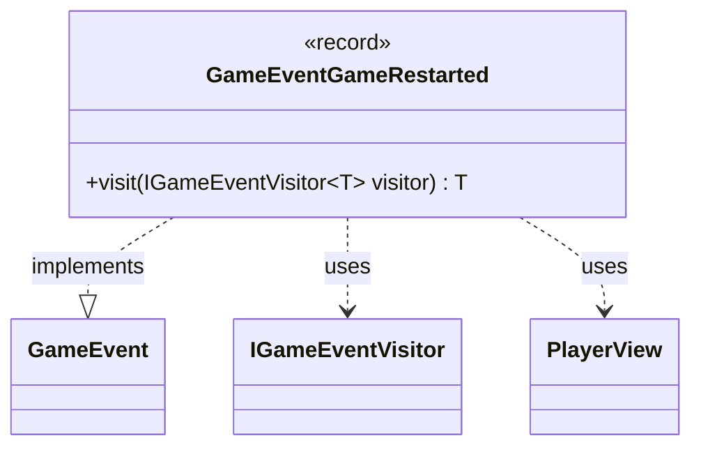

---
aliases:
  - GameEventGameRestarted
tags:
  - java/record
  - module/forge-game
  - pkg/forge/game/event
fqn: forge.game.event.GameEventGameRestarted
package: forge.game.event
module: forge-game
kind: Record
---

# GameEventGameRestarted

**Package:** `forge.game.event` &nbsp; **Module:** `forge-game` &nbsp; **Kind:** Record



## Relationships
**Implements:**
- [[forge.game.event.GameEvent|GameEvent]]
**Uses:**
- [[forge.game.event.IGameEventVisitor|IGameEventVisitor]]
- [[forge.game.player.PlayerView|PlayerView]]

## Design Description

A lightweight, immutable event record that signals a game has been restarted, carrying a single `PlayerView` identifying which player triggered the restart. As a `record` implementing the `GameEvent` interface, it participates in Forge's game-event notification system, where domain occurrences are modeled as small value objects broadcast to interested observers.

Its sole behavior is the `visit` method, which dispatches to an `IGameEventVisitor` by calling back the visitor's overload for this concrete type. This double-dispatch implements the visitor pattern, letting consumers (UI, logging, AI) handle each event kind type-safely without the event itself knowing how it will be processed. Using `PlayerView` rather than the live player model reflects a deliberate separation between game state and the read-only view exposed to event listeners.

## Source
`forge-game/src/main/java/forge/game/event/GameEventGameRestarted.java`

```java
package forge.game.event;

import forge.game.player.PlayerView;

public record GameEventGameRestarted(PlayerView whoRestarted) implements GameEvent {

    @Override
    public <T> T visit(IGameEventVisitor<T> visitor) {
        return visitor.visit(this);
    }
}
```

## Python
`forge/game/event/GameEventGameRestarted.py`

```python
from forge.game.event.GameEvent import GameEvent
from forge.game.event.IGameEventVisitor import IGameEventVisitor
from forge.game.player.PlayerView import PlayerView


class GameEventGameRestarted(GameEvent):

    def __init__(self, whoRestarted: PlayerView):
        self.whoRestarted = whoRestarted

    def visit(self, visitor: IGameEventVisitor):
        return visitor.visit(self)
```
