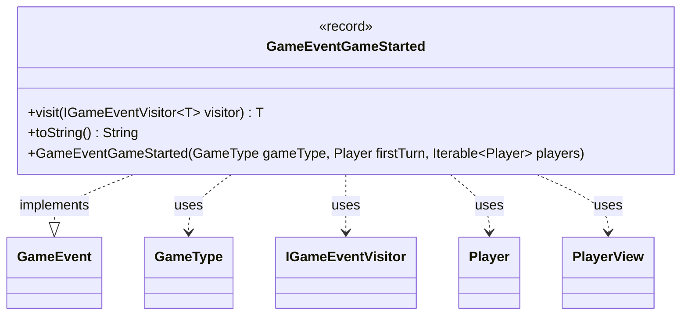

---
aliases:
  - GameEventGameStarted
tags:
  - java/record
  - module/forge-game
  - pkg/forge/game/event
fqn: forge.game.event.GameEventGameStarted
package: forge.game.event
module: forge-game
kind: Record
---

# GameEventGameStarted

**Package:** `forge.game.event` &nbsp; **Module:** `forge-game` &nbsp; **Kind:** Record



## Relationships
**Implements:**
- [[forge.game.event.GameEvent|GameEvent]]
**Uses:**
- [[forge.game.GameType|GameType]]
- [[forge.game.event.IGameEventVisitor|IGameEventVisitor]]
- [[forge.game.player.Player|Player]]
- [[forge.game.player.PlayerView|PlayerView]]

## Design Description

`GameEventGameStarted` is an immutable event record that signals the start of a game, capturing the `GameType`, the player who takes the first turn, and the full set of participating players. As a `GameEvent` implementation, it participates in the engine's event-dispatch mechanism: its `visit` method implements double dispatch against `IGameEventVisitor`, letting visitors handle this concrete event type without the event itself knowing how it will be consumed.

Notably, the record stores `PlayerView` rather than `Player` instances, and a convenience constructor accepts live `Player` objects and converts them via `PlayerView.get`/`getCollection`. This decouples the event from mutable game-model state, making it safe to hand to UI and observer layers that should see only a read-only snapshot. The overridden `toString` composes a human-readable summary using `TextUtil` and `Lang` for grammatically correct player joining.

## Source
`forge-game/src/main/java/forge/game/event/GameEventGameStarted.java`

```java
package forge.game.event;

import forge.game.GameType;
import forge.game.player.Player;
import forge.game.player.PlayerView;
import forge.util.Lang;
import forge.util.TextUtil;

public record GameEventGameStarted(GameType gameType, PlayerView firstTurn, Iterable<PlayerView> players) implements GameEvent {

    public GameEventGameStarted(GameType gameType, Player firstTurn, Iterable<Player> players) {
        this(gameType, PlayerView.get(firstTurn), PlayerView.getCollection(players));
    }

    @Override
    public <T> T visit(IGameEventVisitor<T> visitor) {
        return visitor.visit(this);
    }

    /* (non-Javadoc)
     * @see java.lang.Object#toString()
     */
    @Override
    public String toString() {
        return TextUtil.concatWithSpace(gameType.toString(),"game between", Lang.joinHomogenous(players), "started.", firstTurn.toString(), "goes first ");
    }

}
```

## Python
`forge/game/event/GameEventGameStarted.py`

```python
from forge.game.event.GameEvent import GameEvent
from forge.game.GameType import GameType
from forge.game.event.IGameEventVisitor import IGameEventVisitor
from forge.game.player.Player import Player
from forge.game.player.PlayerView import PlayerView
from forge.util.Lang import Lang
from forge.util.TextUtil import TextUtil


class GameEventGameStarted(GameEvent):

    def __init__(self, gameType: GameType, firstTurn, players):
        if isinstance(firstTurn, Player):
            self.gameType = gameType
            self.firstTurn = PlayerView.get(firstTurn)
            self.players = PlayerView.getCollection(players)
        else:
            self.gameType = gameType
            self.firstTurn = firstTurn
            self.players = players

    def visit(self, visitor: IGameEventVisitor):
        return visitor.visit(self)

    # (non-Javadoc)
    # @see java.lang.Object#toString()
    def toString(self) -> str:
        return TextUtil.concatWithSpace(self.gameType.toString(), "game between", Lang.joinHomogenous(self.players), "started.", self.firstTurn.toString(), "goes first ")

    def __str__(self) -> str:
        return self.toString()
```
