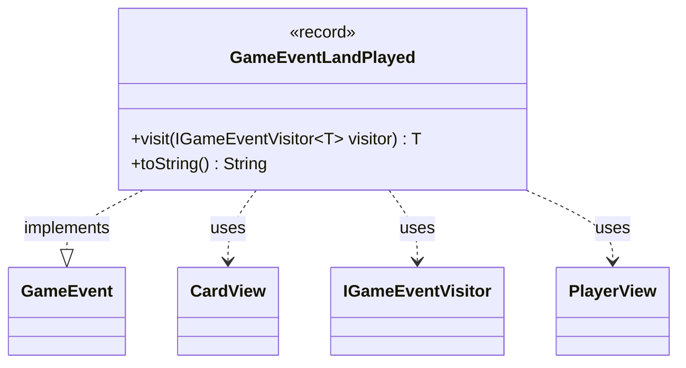

---
aliases:
  - GameEventLandPlayed
tags:
  - java/record
  - module/forge-game
  - pkg/forge/game/event
fqn: forge.game.event.GameEventLandPlayed
package: forge.game.event
module: forge-game
kind: Record
---

# GameEventLandPlayed

**Package:** `forge.game.event` &nbsp; **Module:** `forge-game` &nbsp; **Kind:** Record



## Relationships
**Implements:**
- [[forge.game.event.GameEvent|GameEvent]]
**Uses:**
- [[forge.game.card.CardView|CardView]]
- [[forge.game.event.IGameEventVisitor|IGameEventVisitor]]
- [[forge.game.player.PlayerView|PlayerView]]

## Design Description

`GameEventLandPlayed` is an immutable record capturing the fact that a player has played a land, bundling the acting `PlayerView` and the played `CardView` as its two components. As a concrete implementation of the `GameEvent` interface, it participates in the engine's event-notification system, representing one specific kind of game occurrence that observers can react to.

Its design follows the visitor pattern: the `visit` method dispatches the event back to an `IGameEventVisitor`, letting varied handlers process each event type without the record needing to know their logic, while the generic return type lets visitors yield results of any kind. Using lightweight view types (`PlayerView`, `CardView`) rather than core model objects keeps the event decoupled from internal game state, suiting it for safe propagation to UI and other consumers. The overridden `toString` produces a readable, human-friendly summary of the action.

## Source
`forge-game/src/main/java/forge/game/event/GameEventLandPlayed.java`

```java
package forge.game.event;

import forge.game.card.CardView;
import forge.game.player.PlayerView;

public record GameEventLandPlayed(PlayerView player, CardView land) implements GameEvent {

    @Override
    public <T> T visit(IGameEventVisitor<T> visitor) {
        return visitor.visit(this);
    }

    /* (non-Javadoc)
     * @see java.lang.Object#toString()
     */
    @Override
    public String toString() {
        return "" + player + " played " + land;
    }
}
```
