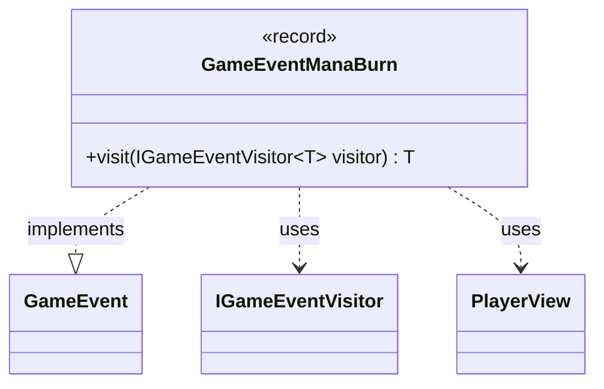

---
aliases:
  - GameEventManaBurn
tags:
  - java/record
  - module/forge-game
  - pkg/forge/game/event
fqn: forge.game.event.GameEventManaBurn
package: forge.game.event
module: forge-game
kind: Record
---

# GameEventManaBurn

**Package:** `forge.game.event`   **Module:** `forge-game`   **Kind:** Record



## Relationships
**Implements:**
- [[forge.game.event.GameEvent|GameEvent]]
**Uses:**
- [[forge.game.event.IGameEventVisitor|IGameEventVisitor]]
- [[forge.game.player.PlayerView|PlayerView]]

## Design Description

`GameEventManaBurn` is an immutable record signaling that a player has lost unspent mana at the end of a phase ("mana burn"), capturing the affected `PlayerView`, whether the loss reduced the player's life, and the quantity drained. As a concrete event it implements the `GameEvent` interface, slotting into Forge's event-notification system that decouples game-state changes from the UI and other observers.

It participates in a visitor pattern: its `visit` method dispatches to the generically-typed `IGameEventVisitor`, letting each visitor handle this event type while returning a caller-determined result `T`. Modeling the event as a record makes it a lightweight, value-based, read-only carrier—deliberately holding only the data describing what happened, with no behavior beyond double-dispatch.

## Source
`forge-game/src/main/java/forge/game/event/GameEventManaBurn.java`

```java
package forge.game.event;

import forge.game.player.PlayerView;

// This special event denotes loss of mana due to phase end
public record GameEventManaBurn(PlayerView player, boolean causedLifeLoss, int amount) implements GameEvent {

    @Override
    public <T> T visit(IGameEventVisitor<T> visitor) {
        return visitor.visit(this);
    }
}
```

## Python
`forge/game/event/GameEventManaBurn.py`

```python
package = None
from forge.game.player.PlayerView import PlayerView
from forge.game.event.GameEvent import GameEvent
from forge.game.event.IGameEventVisitor import IGameEventVisitor


# This special event denotes loss of mana due to phase end
class GameEventManaBurn(GameEvent):
    def __init__(self, player: PlayerView, causedLifeLoss: bool, amount: int):
        self.player = player
        self.causedLifeLoss = causedLifeLoss
        self.amount = amount

    def visit(self, visitor: IGameEventVisitor):
        return visitor.visit(self)
```
