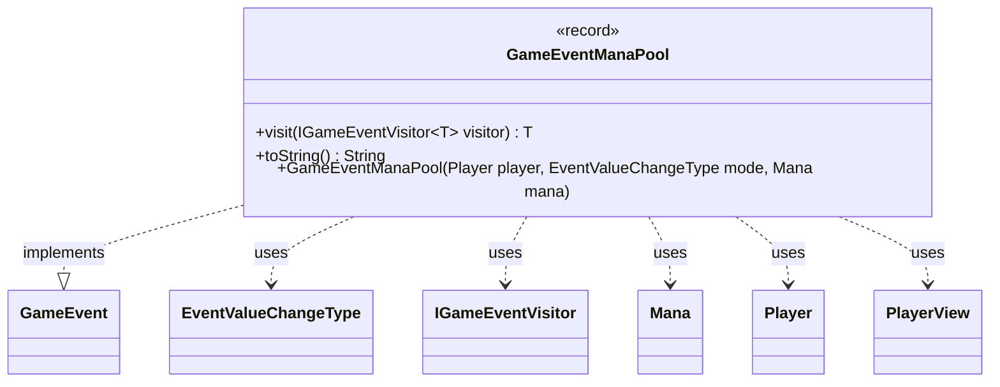

---
aliases:
  - GameEventManaPool
tags:
  - java/record
  - module/forge-game
  - pkg/forge/game/event
fqn: forge.game.event.GameEventManaPool
package: forge.game.event
module: forge-game
kind: Record
---

# GameEventManaPool

**Package:** `forge.game.event` &nbsp; **Module:** `forge-game` &nbsp; **Kind:** Record



## Relationships
**Implements:**
- [[forge.game.event.GameEvent|GameEvent]]
**Uses:**
- [[forge.game.event.EventValueChangeType|EventValueChangeType]]
- [[forge.game.event.IGameEventVisitor|IGameEventVisitor]]
- [[forge.game.mana.Mana|Mana]]
- [[forge.game.player.Player|Player]]
- [[forge.game.player.PlayerView|PlayerView]]

## Design Description

GameEventManaPool is an immutable record-based event that signals a change to a player's mana pool, fitting into the engine's event-notification framework. It implements the `GameEvent` interface and supports the visitor pattern: its `visit` method dispatches to an `IGameEventVisitor`, letting consumers handle the event without the event itself knowing their concerns. The record carries a lightweight `PlayerView`, an `EventValueChangeType` mode describing the change (e.g., Added or Removed), and the mana's color as a `byte`.

Notably, a convenience constructor accepts the domain `Player` and `Mana` types, converting them to the view layer (`PlayerView`) and extracting just the color byte—decoupling event consumers from the live game model and tolerating a null `Mana` by defaulting to colorless. The overridden `toString` produces a human-readable, localized summary via `Lang`.

## Source
`forge-game/src/main/java/forge/game/event/GameEventManaPool.java`

```java
package forge.game.event;

import forge.game.mana.Mana;
import forge.game.player.Player;
import forge.game.player.PlayerView;
import forge.util.Lang;

public record GameEventManaPool(PlayerView player, EventValueChangeType mode, byte manaColor) implements GameEvent {

    public GameEventManaPool(Player player, EventValueChangeType mode, Mana mana) {
        this(PlayerView.get(player), mode, mana != null ? mana.getColor() : (byte) 0);
    }

    @Override
    public <T> T visit(IGameEventVisitor<T> visitor) {
        return visitor.visit(this);
    }

    /* (non-Javadoc)
     * @see java.lang.Object#toString()
     */
    @Override
    public String toString() {
        StringBuilder sb = new StringBuilder(Lang.getInstance().getPossessedObject(player.getName(), "mana pool"));
        sb.append(" ").append(mode);
        switch (mode) {
        case Added:
        case Removed:
            sb.append(" - ").append(manaColor);
            break;
        default:
            break;
        
        }
        return sb.toString();
    }
}
```
