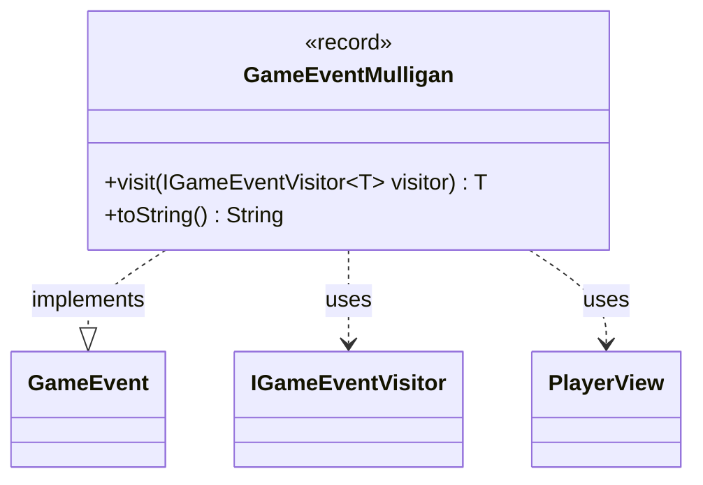

---
aliases:
  - GameEventMulligan
tags:
  - java/record
  - module/forge-game
  - pkg/forge/game/event
fqn: forge.game.event.GameEventMulligan
package: forge.game.event
module: forge-game
kind: Record
---

# GameEventMulligan

**Package:** `forge.game.event` &nbsp; **Module:** `forge-game` &nbsp; **Kind:** Record



## Relationships
**Implements:**
- [[forge.game.event.GameEvent|GameEvent]]
**Uses:**
- [[forge.game.event.IGameEventVisitor|IGameEventVisitor]]
- [[forge.game.player.PlayerView|PlayerView]]

## Design Description

GameEventMulligan is an immutable record that signals a single player has taken a mulligan, capturing only the affected `PlayerView`. As a concrete implementation of the `GameEvent` interface, it participates in the engine's event-notification system, allowing game-state changes to be broadcast to observers without coupling them to the producing logic.

Its `visit` method realizes the visitor pattern: it dispatches to the supplied `IGameEventVisitor`, letting each visitor handle the event generically while returning a caller-specified type `T`. This double-dispatch design keeps event-handling behavior external to the event classes, so new consumers can be added without modifying the events themselves. The overridden `toString` yields a human-readable log line. Using a record reflects the deliberate intent that the event be a lightweight, value-based, immutable carrier of data.

## Source
`forge-game/src/main/java/forge/game/event/GameEventMulligan.java`

```java
package forge.game.event;

import forge.game.player.PlayerView;

public record GameEventMulligan(PlayerView player) implements GameEvent {

    @Override
    public <T> T visit(IGameEventVisitor<T> visitor) {
        return visitor.visit(this);
    }

    /* (non-Javadoc)
     * @see java.lang.Object#toString()
     */
    @Override
    public String toString() {
        return "" + player + " mulligans";
    }
}
```
