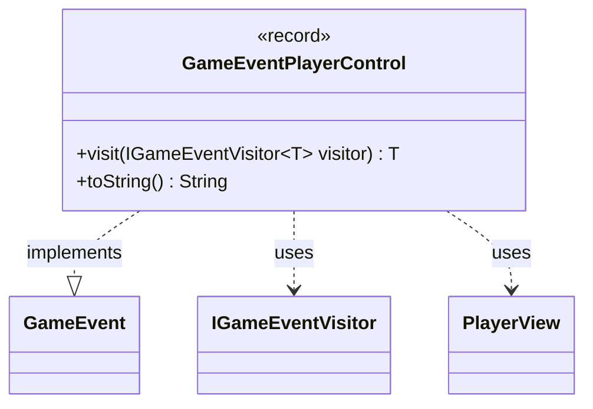

---
aliases:
  - GameEventPlayerControl
tags:
  - java/record
  - module/forge-game
  - pkg/forge/game/event
fqn: forge.game.event.GameEventPlayerControl
package: forge.game.event
module: forge-game
kind: Record
---

# GameEventPlayerControl

**Package:** `forge.game.event` &nbsp; **Module:** `forge-game` &nbsp; **Kind:** Record



## Relationships
**Implements:**
- [[forge.game.event.GameEvent|GameEvent]]
**Uses:**
- [[forge.game.event.IGameEventVisitor|IGameEventVisitor]]
- [[forge.game.player.PlayerView|PlayerView]]

## Design Description

GameEventPlayerControl is an immutable event record signaling that control of a player has changed—capturing the affected player, the new lobby player's name, and whether the new controller is human. As a `GameEvent` implementation, it participates in Forge's event-dispatch system, which decouples game-state changes from observers such as UI or AI components.

Its `visit` method implements the visitor pattern, dispatching to the type-parameterized `IGameEventVisitor` so each event type is handled in a type-safe way without instanceof checks. It collaborates with `PlayerView`, the presentation-facing snapshot of a player, rather than the live player model—reflecting a deliberate separation between game logic and view state. The overridden `toString` yields a human-readable summary of the control reassignment for logging or display.

## Source
`forge-game/src/main/java/forge/game/event/GameEventPlayerControl.java`

```java
package forge.game.event;

import forge.game.player.PlayerView;

public record GameEventPlayerControl(PlayerView player, String newLobbyPlayerName, boolean newControllerIsHuman) implements GameEvent {

    @Override
    public <T> T visit(final IGameEventVisitor<T> visitor) {
        return visitor.visit(this);
    }

    /* (non-Javadoc)
     * @see java.lang.Object#toString()
     */
    @Override
    public String toString() {
        return "" + player + " controlled by " + newLobbyPlayerName;
    }
}
```
