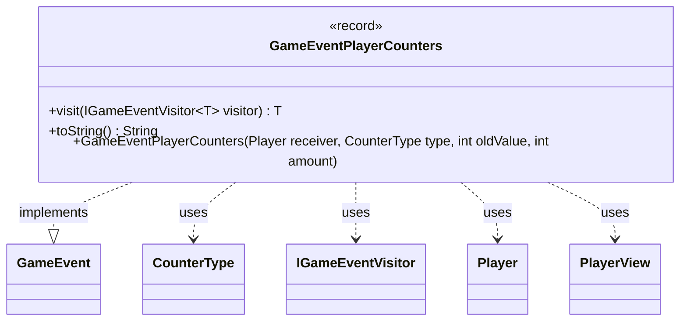

---
aliases:
  - GameEventPlayerCounters
tags:
  - java/record
  - module/forge-game
  - pkg/forge/game/event
fqn: forge.game.event.GameEventPlayerCounters
package: forge.game.event
module: forge-game
kind: Record
---

# GameEventPlayerCounters

**Package:** `forge.game.event` &nbsp; **Module:** `forge-game` &nbsp; **Kind:** Record



## Relationships
**Implements:**
- [[forge.game.event.GameEvent|GameEvent]]
**Uses:**
- [[forge.game.card.CounterType|CounterType]]
- [[forge.game.event.IGameEventVisitor|IGameEventVisitor]]
- [[forge.game.player.Player|Player]]
- [[forge.game.player.PlayerView|PlayerView]]

## Design Description

GameEventPlayerCounters is an immutable record that signals a change to the number of counters of a given `CounterType` on a player. As a value-type event it captures the affected player (stored as a `PlayerView` for the UI/observer layer), the counter type, the prior count, and the delta added. Implementing `GameEvent`, it participates in the engine's visitor-based event dispatch: its `visit` method double-dispatches to an `IGameEventVisitor`, letting listeners handle the event without the event itself knowing their concrete types.

A convenience constructor accepts a domain `Player` and adapts it to a `PlayerView` via `PlayerView.get`, decoupling the event payload from the mutable game model. The overridden `toString` yields a human-readable summary for logging or debugging.

## Source
`forge-game/src/main/java/forge/game/event/GameEventPlayerCounters.java`

```java
package forge.game.event;

import forge.game.card.CounterType;
import forge.game.player.Player;
import forge.game.player.PlayerView;

public record GameEventPlayerCounters(PlayerView receiver, CounterType type, int oldValue, int amount) implements GameEvent {

    public GameEventPlayerCounters(Player receiver, CounterType type, int oldValue, int amount) {
        this(PlayerView.get(receiver), type, oldValue, amount);
    }

    @Override
    public <T> T visit(IGameEventVisitor<T> visitor) {
        return visitor.visit(this);
    }

    /* (non-Javadoc)
     * @see java.lang.Object#toString()
     */
    @Override
    public String toString() {
        return "" + receiver + " got " + oldValue + " plus " + amount + " " + type;
    }
}
```
