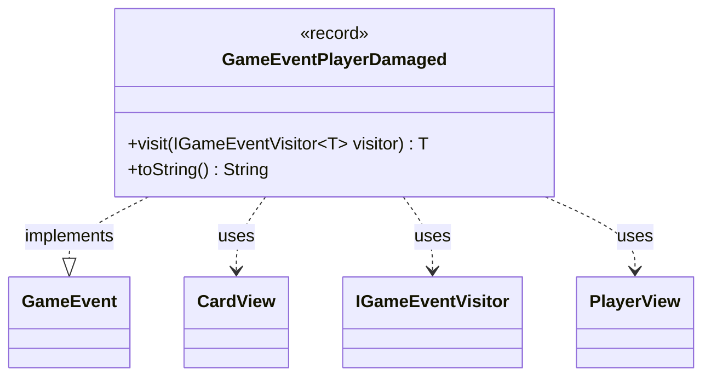

---
aliases:
  - GameEventPlayerDamaged
tags:
  - java/record
  - module/forge-game
  - pkg/forge/game/event
fqn: forge.game.event.GameEventPlayerDamaged
package: forge.game.event
module: forge-game
kind: Record
---

# GameEventPlayerDamaged

**Package:** `forge.game.event` &nbsp; **Module:** `forge-game` &nbsp; **Kind:** Record



## Relationships
**Implements:**
- [[forge.game.event.GameEvent|GameEvent]]
**Uses:**
- [[forge.game.card.CardView|CardView]]
- [[forge.game.event.IGameEventVisitor|IGameEventVisitor]]
- [[forge.game.player.PlayerView|PlayerView]]

## Design Description

`GameEventPlayerDamaged` is an immutable event record that captures a single instance of a player taking damage, bundling the affected `PlayerView` target, the `CardView` source, the damage amount, and flags indicating whether the damage was combat-related or carried infect. As a `GameEvent` implementation, it participates in the engine's event-notification system: its `visit` method dispatches to the appropriate handler on an `IGameEventVisitor`, applying the visitor pattern so consumers (such as UI or logging components) can react to typed events without the event itself knowing their concerns.

Using `PlayerView` and `CardView` rather than live model objects reflects a deliberate decoupling of the game state from observers, exposing only read-only views. The record form enforces immutability suited to a fire-and-forget notification, while the overridden `toString` produces a human-readable summary that distinguishes infect, combat, and ordinary damage for display or debugging.

## Source
`forge-game/src/main/java/forge/game/event/GameEventPlayerDamaged.java`

```java
package forge.game.event;

import forge.game.card.CardView;
import forge.game.player.PlayerView;

public record GameEventPlayerDamaged(PlayerView target, CardView source, int amount, boolean combat, boolean infect) implements GameEvent {

    /* (non-Javadoc)
     * @see forge.game.event.GameEvent#visit(forge.game.event.IGameEventVisitor)
     */
    @Override
    public <T> T visit(IGameEventVisitor<T> visitor) {
        return visitor.visit(this);
    }

    /* (non-Javadoc)
     * @see java.lang.Object#toString()
     */
    @Override
    public String toString() {
        return "" + target + " took " + amount + (infect ? " infect" : combat ? " combat" : "") + " damage from " + source;
    }
}
```

## Python
`forge/game/event/GameEventPlayerDamaged.py`

```python
package forge.game.event;
from forge.game.card.CardView import CardView
from forge.game.event.GameEvent import GameEvent
from forge.game.event.IGameEventVisitor import IGameEventVisitor
from forge.game.player.PlayerView import PlayerView


class GameEventPlayerDamaged(GameEvent):

    def __init__(self, target: PlayerView, source: CardView, amount: int, combat: bool, infect: bool):
        self.target = target
        self.source = source
        self.amount = amount
        self.combat = combat
        self.infect = infect

    def visit(self, visitor: IGameEventVisitor):
        return visitor.visit(self)

    def __str__(self) -> str:
        return "" + str(self.target) + " took " + str(self.amount) + (" infect" if self.infect else " combat" if self.combat else "") + " damage from " + str(self.source)
```
