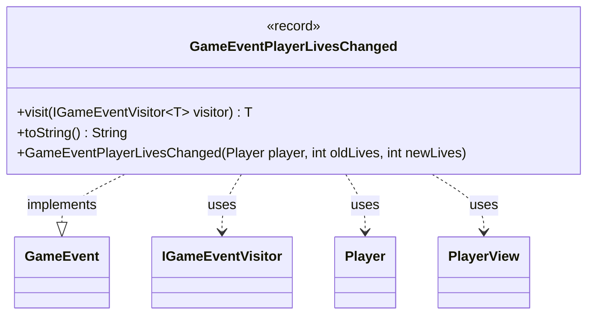

---
aliases:
  - GameEventPlayerLivesChanged
tags:
  - java/record
  - module/forge-game
  - pkg/forge/game/event
fqn: forge.game.event.GameEventPlayerLivesChanged
package: forge.game.event
module: forge-game
kind: Record
---

# GameEventPlayerLivesChanged

**Package:** `forge.game.event` &nbsp; **Module:** `forge-game` &nbsp; **Kind:** Record



## Relationships
**Implements:**
- [[forge.game.event.GameEvent|GameEvent]]
**Uses:**
- [[forge.game.event.IGameEventVisitor|IGameEventVisitor]]
- [[forge.game.player.Player|Player]]
- [[forge.game.player.PlayerView|PlayerView]]

## Design Description

`GameEventPlayerLivesChanged` is an immutable record that signals a change to a player's life total, capturing the affected player along with the previous and new life values. As a concrete implementation of the `GameEvent` interface, it participates in the engine's event system, exposing a `visit` method that dispatches to an `IGameEventVisitor` via the visitor pattern—decoupling event production from the varied consumers (UI, logging, AI) that react to it. To insulate observers from the mutable game model, the canonical constructor stores a lightweight `PlayerView` rather than the live `Player`; a convenience constructor accepts a `Player` and converts it through `PlayerView.get`. The overridden `toString` produces a human-readable summary (e.g., "Alice's lives changed: 3 -> 2") using `Lang` and `TextUtil` for localized, consistent formatting.

## Source
`forge-game/src/main/java/forge/game/event/GameEventPlayerLivesChanged.java`

```java
package forge.game.event;

import forge.game.player.Player;
import forge.game.player.PlayerView;
import forge.util.Lang;
import forge.util.TextUtil;

public record GameEventPlayerLivesChanged(PlayerView player, int oldLives, int newLives) implements GameEvent {

    public GameEventPlayerLivesChanged(Player player, int oldLives, int newLives) {
        this(PlayerView.get(player), oldLives, newLives);
    }

    @Override
    public <T> T visit(IGameEventVisitor<T> visitor) {
        return visitor.visit(this);
    }

    @Override
    public String toString() {
        return TextUtil.concatWithSpace(Lang.getInstance().getPossesive(player.getName()),"lives changed:",  String.valueOf(oldLives),"->", String.valueOf(newLives));
    }
}
```
