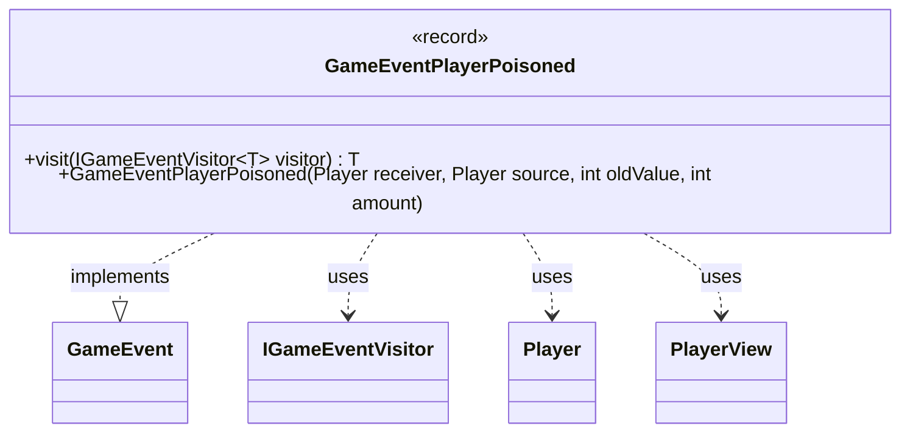

---
aliases:
  - GameEventPlayerPoisoned
tags:
  - java/record
  - module/forge-game
  - pkg/forge/game/event
fqn: forge.game.event.GameEventPlayerPoisoned
package: forge.game.event
module: forge-game
kind: Record
---

# GameEventPlayerPoisoned

**Package:** `forge.game.event` &nbsp; **Module:** `forge-game` &nbsp; **Kind:** Record



## Relationships
**Implements:**
- [[forge.game.event.GameEvent|GameEvent]]
**Uses:**
- [[forge.game.event.IGameEventVisitor|IGameEventVisitor]]
- [[forge.game.player.Player|Player]]
- [[forge.game.player.PlayerView|PlayerView]]

## Design Description

`GameEventPlayerPoisoned` is an immutable record that signals a player has received poison counters, capturing the affected player (`receiver`), the player responsible (`source`), the prior poison total (`oldValue`), and the `amount` added. As an implementer of the `GameEvent` interface, it participates in Forge's event-notification system, allowing game-state changes to be broadcast to observers without coupling the engine to specific consumers. Its `visit` method realizes the visitor pattern by dispatching to an `IGameEventVisitor`, so each handler can react to this event type in a type-safe way while the engine remains agnostic about how it is processed.

A notable design choice is the convenience constructor accepting live `Player` objects, which immediately converts them to lightweight, serializable `PlayerView` snapshots via `PlayerView.get`. This decouples the event from mutable model state, ensuring the carried data reflects the moment of poisoning and remains safe to pass across the game/UI boundary.

## Source
`forge-game/src/main/java/forge/game/event/GameEventPlayerPoisoned.java`

```java
package forge.game.event;

import forge.game.player.Player;
import forge.game.player.PlayerView;

/**
 *
 *
 */
public record GameEventPlayerPoisoned(PlayerView receiver, PlayerView source, int oldValue, int amount) implements GameEvent {

    public GameEventPlayerPoisoned(Player receiver, Player source, int oldValue, int amount) {
        this(PlayerView.get(receiver), PlayerView.get(source), oldValue, amount);
    }

    @Override
    public <T> T visit(IGameEventVisitor<T> visitor) {
        return visitor.visit(this);
    }
}
```
