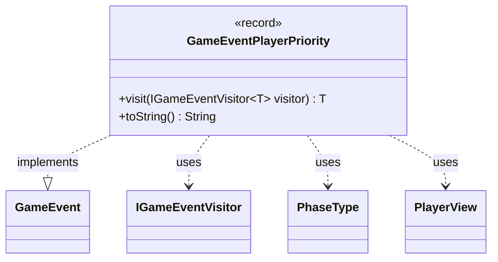

---
aliases:
  - GameEventPlayerPriority
tags:
  - java/record
  - module/forge-game
  - pkg/forge/game/event
fqn: forge.game.event.GameEventPlayerPriority
package: forge.game.event
module: forge-game
kind: Record
---

# GameEventPlayerPriority

**Package:** `forge.game.event` &nbsp; **Module:** `forge-game` &nbsp; **Kind:** Record



## Relationships
**Implements:**
- [[forge.game.event.GameEvent|GameEvent]]
**Uses:**
- [[forge.game.event.IGameEventVisitor|IGameEventVisitor]]
- [[forge.game.phase.PhaseType|PhaseType]]
- [[forge.game.player.PlayerView|PlayerView]]

## Design Description

Priorities the player's window to act. As a record, it captures an immutable snapshot of a priority-passing moment: the player whose turn it is (`turn`), the current `PhaseType`, and the player who now holds priority (`priority`), all exposed through generated accessors.

As a concrete `GameEvent`, it participates in the engine's event-dispatch system via the visitor pattern: `visit` double-dispatches to the appropriate `IGameEventVisitor` overload, decoupling event production from the handlers (UI, AI, logging) that consume it. The custom `toString` yields a compact human-readable label for the priority holder, useful for game logs and debugging. Its reliance on the lightweight `PlayerView` rather than full player objects reflects a deliberate separation between game state and the view layer that observes it.

## Source
`forge-game/src/main/java/forge/game/event/GameEventPlayerPriority.java`

```java
package forge.game.event;

import forge.game.phase.PhaseType;
import forge.game.player.PlayerView;
import forge.util.TextUtil;

public record GameEventPlayerPriority(PlayerView turn, PhaseType phase, PlayerView priority) implements GameEvent {

    @Override
    public <T> T visit(IGameEventVisitor<T> visitor) {
        return visitor.visit(this);
    }

    /* (non-Javadoc)
     * @see java.lang.Object#toString()
     */
    @Override
    public String toString() {
        return TextUtil.concatWithSpace("Priority -", priority.toString());
    }
}
```

## Python
`forge/game/event/GameEventPlayerPriority.py`

```python
from forge.game.event.GameEvent import GameEvent
from forge.game.event.IGameEventVisitor import IGameEventVisitor
from forge.game.phase.PhaseType import PhaseType
from forge.game.player.PlayerView import PlayerView
from forge.util.TextUtil import TextUtil


class GameEventPlayerPriority(GameEvent):

    def __init__(self, turn: PlayerView, phase: PhaseType, priority: PlayerView):
        self.turn = turn
        self.phase = phase
        self.priority = priority

    def visit(self, visitor: IGameEventVisitor):
        return visitor.visit(self)

    # (non-Javadoc)
    # @see java.lang.Object#toString()
    def toString(self) -> str:
        return TextUtil.concatWithSpace("Priority -", self.priority.toString())
```
