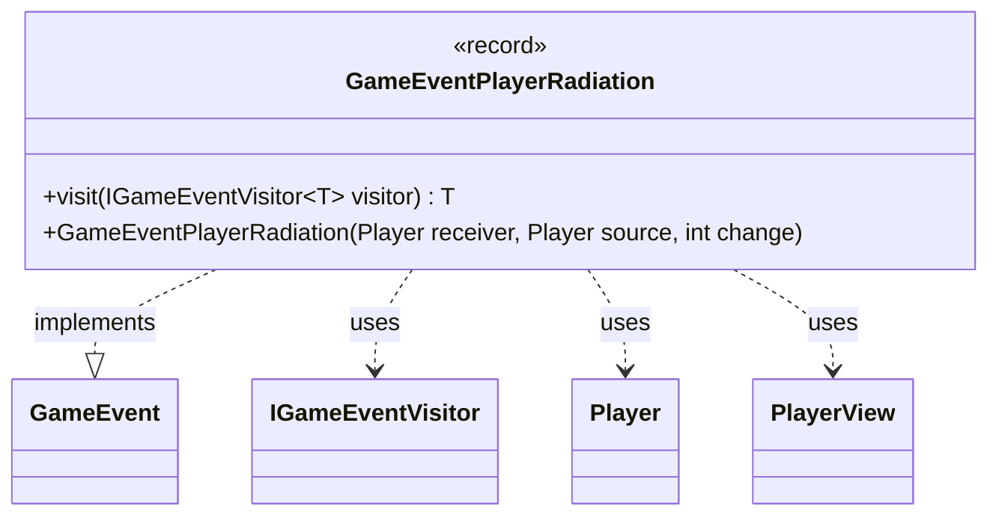

---
aliases:
  - GameEventPlayerRadiation
tags:
  - java/record
  - module/forge-game
  - pkg/forge/game/event
fqn: forge.game.event.GameEventPlayerRadiation
package: forge.game.event
module: forge-game
kind: Record
---

# GameEventPlayerRadiation

**Package:** `forge.game.event` &nbsp; **Module:** `forge-game` &nbsp; **Kind:** Record



## Relationships
**Implements:**
- [[forge.game.event.GameEvent|GameEvent]]
**Uses:**
- [[forge.game.event.IGameEventVisitor|IGameEventVisitor]]
- [[forge.game.player.Player|Player]]
- [[forge.game.player.PlayerView|PlayerView]]

## Design Description

`GameEventPlayerRadiation` is an immutable record that signals a change to a player's radiation counters within the forge-game event system. As a `GameEvent`, it carries the affected `receiver`, the originating `source`, and the integer `change` amount, exposing them as record components for consumers reacting to the event.

It participates in a visitor-based dispatch pattern: its `visit` method forwards to an `IGameEventVisitor`, letting handlers process the event without the class knowing their concrete types. A notable design choice is the convenience constructor accepting live `Player` objects, which it immediately converts to lightweight, serializable `PlayerView` snapshots via `PlayerView.get`. This decouples emitted events from mutable game state, ensuring the event remains a stable value safe to pass to the UI or other observers.

## Source
`forge-game/src/main/java/forge/game/event/GameEventPlayerRadiation.java`

```java
package forge.game.event;

import forge.game.player.Player;
import forge.game.player.PlayerView;

public record GameEventPlayerRadiation(PlayerView receiver, PlayerView source, int change) implements GameEvent {

    public GameEventPlayerRadiation(Player receiver, Player source, int change) {
        this(PlayerView.get(receiver), PlayerView.get(source), change);
    }

    @Override
    public <T> T visit(IGameEventVisitor<T> visitor) {
        return visitor.visit(this);
    }
}
```
