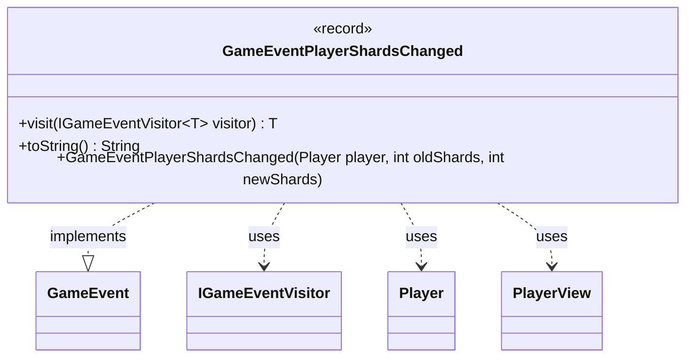

---
aliases:
  - GameEventPlayerShardsChanged
tags:
  - java/record
  - module/forge-game
  - pkg/forge/game/event
fqn: forge.game.event.GameEventPlayerShardsChanged
package: forge.game.event
module: forge-game
kind: Record
---

# GameEventPlayerShardsChanged

**Package:** `forge.game.event` &nbsp; **Module:** `forge-game` &nbsp; **Kind:** Record



## Relationships
**Implements:**
- [[forge.game.event.GameEvent|GameEvent]]
**Uses:**
- [[forge.game.event.IGameEventVisitor|IGameEventVisitor]]
- [[forge.game.player.Player|Player]]
- [[forge.game.player.PlayerView|PlayerView]]

## Design Description

The class `GameEventPlayerShardsChanged` is a record in the `forge.game.event` package that signals a change in a player's shard count, carrying the affected player (as a `PlayerView`), the previous shard total, and the new total. As an immutable event, it participates in the engine's observer mechanism by implementing the `GameEvent` interface and dispatching itself through the generic visitor `IGameEventVisitor`, enabling type-safe handling by interested listeners.

The design reflects a deliberate view/model separation: a convenience constructor accepts a live `Player` and snapshots it into a `PlayerView` via `PlayerView.get`, decoupling the event from mutable game state so it can be safely consumed by the UI layer. Its `toString` override produces a human-readable summary (e.g., a possessive player name with the old-to-new shard transition) using `Lang` and `TextUtil` for localized, formatted output.

## Source
`forge-game/src/main/java/forge/game/event/GameEventPlayerShardsChanged.java`

```java
package forge.game.event;

import forge.game.player.Player;
import forge.game.player.PlayerView;
import forge.util.Lang;
import forge.util.TextUtil;

public record GameEventPlayerShardsChanged(PlayerView player, int oldShards, int newShards) implements GameEvent {

    public GameEventPlayerShardsChanged(Player player, int oldShards, int newShards) {
        this(PlayerView.get(player), oldShards, newShards);
    }

    @Override
    public <T> T visit(IGameEventVisitor<T> visitor) {
        return visitor.visit(this);
    }

    @Override
    public String toString() {
        return TextUtil.concatWithSpace(Lang.getInstance().getPossesive(player.getName()),"shards changed:",  String.valueOf(oldShards),"->", String.valueOf(newShards));
    }
}
```
