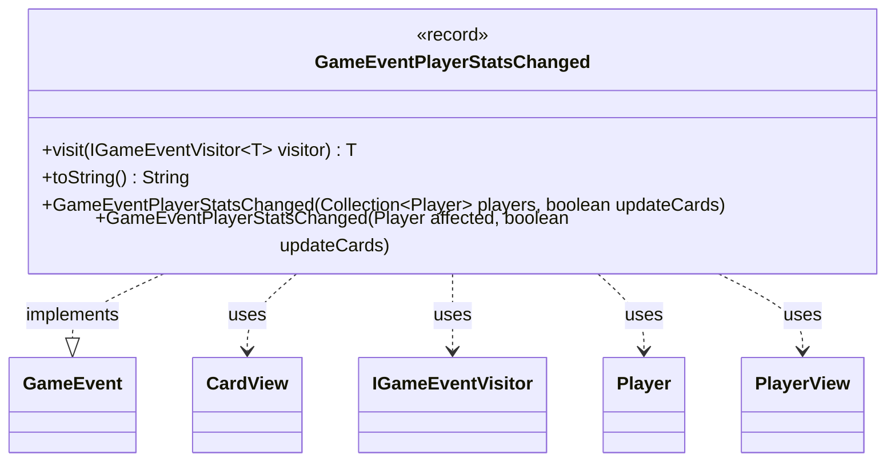

---
aliases:
  - GameEventPlayerStatsChanged
tags:
  - java/record
  - module/forge-game
  - pkg/forge/game/event
fqn: forge.game.event.GameEventPlayerStatsChanged
package: forge.game.event
module: forge-game
kind: Record
---

# GameEventPlayerStatsChanged

**Package:** `forge.game.event` &nbsp; **Module:** `forge-game` &nbsp; **Kind:** Record



## Relationships
**Implements:**
- [[forge.game.event.GameEvent|GameEvent]]
**Uses:**
- [[forge.game.card.CardView|CardView]]
- [[forge.game.event.IGameEventVisitor|IGameEventVisitor]]
- [[forge.game.player.Player|Player]]
- [[forge.game.player.PlayerView|PlayerView]]

## Design Description

This record models a server-side notification that a player's statistics have changed, signaling clients to re-request the affected players' state and, optionally, their cards. As a `GameEvent`, it participates in the engine's visitor-based event dispatch, implementing `visit` to route itself to the appropriate `IGameEventVisitor` handler. It is deliberately immutable, carrying view-layer snapshots (`PlayerView`, `CardView`) rather than live model objects so the data can safely cross the server-to-client boundary.

The convenience constructors capture the design intent: callers supply domain `Player` objects (singly or as a collection), and the canonical constructor eagerly converts them into views, conditionally flattening each player's cards into a `CardView` list only when `updateCards` is set—avoiding needless work otherwise. The `toString` override yields a human-readable summary for logging, gracefully handling the empty case.

## Source
`forge-game/src/main/java/forge/game/event/GameEventPlayerStatsChanged.java`

```java
package forge.game.event;

import java.util.Arrays;
import java.util.Collection;
import java.util.Collections;
import java.util.stream.Collectors;
import java.util.stream.StreamSupport;

import forge.game.card.CardView;
import forge.game.player.Player;
import forge.game.player.PlayerView;
import forge.util.Lang;
import forge.util.TextUtil;

/**
 * This means card's characteristics have changed on server, clients must re-request them
 */
public record GameEventPlayerStatsChanged(Collection<PlayerView> players, boolean updateCards, Collection<CardView> allCards) implements GameEvent {

    public GameEventPlayerStatsChanged(Collection<Player> players, boolean updateCards) {
        this(PlayerView.getCollection(players), updateCards,
             updateCards ? players.stream().flatMap(p -> StreamSupport.stream(p.getAllCards().spliterator(), false))
                     .map(CardView::get).collect(Collectors.toList()) : Collections.emptyList());
    }

    public GameEventPlayerStatsChanged(Player affected, boolean updateCards) {
        this(Arrays.asList(affected), updateCards);
    }

    /* (non-Javadoc)
     * @see forge.game.event.GameEvent#visit(forge.game.event.IGameEventVisitor)
     */
    @Override
    public <T> T visit(IGameEventVisitor<T> visitor) {
        return visitor.visit(this);
    }

    @Override
    public String toString() {
        if (null == players || players.isEmpty()) {
            return "Player state changes: (empty list)";
        }
        return TextUtil.concatWithSpace("Player state changes:", Lang.joinHomogenous(players));
    }

}
```
