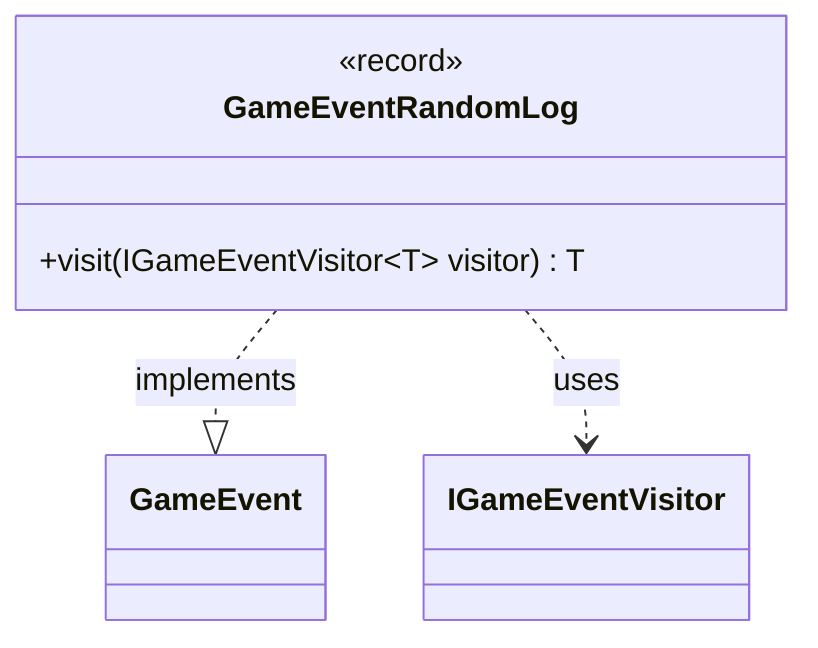

---
aliases:
  - GameEventRandomLog
tags:
  - java/record
  - module/forge-game
  - pkg/forge/game/event
fqn: forge.game.event.GameEventRandomLog
package: forge.game.event
module: forge-game
kind: Record
---

# GameEventRandomLog

**Package:** `forge.game.event` &nbsp; **Module:** `forge-game` &nbsp; **Kind:** Record



## Relationships
**Implements:**
- [[forge.game.event.GameEvent|GameEvent]]
**Uses:**
- [[forge.game.event.IGameEventVisitor|IGameEventVisitor]]

## Design Description

The `GameEventRandomLog` record captures a loggable, human-readable random-outcome message produced during gameplay, packaging it as an immutable event for the engine's event pipeline. As a `record`, it leverages Java's compact syntax to derive its single `message` accessor, equality, and string representation automatically, signalling that it is a pure value carrier with no behavior beyond data.

It implements the `GameEvent` interface, fitting into a visitor-based dispatch design: rather than encoding handling logic itself, it delegates to a generic `IGameEventVisitor<T>` via `visit`, which calls back the visitor's type-specific overload (double dispatch). This keeps event types decoupled from their consumers, letting observers such as loggers or UI listeners process each concrete event without the events knowing their handlers.

## Source
`forge-game/src/main/java/forge/game/event/GameEventRandomLog.java`

```java
package forge.game.event;

public record GameEventRandomLog(String message) implements GameEvent {

    @Override
    public <T> T visit(IGameEventVisitor<T> visitor) {
        return visitor.visit(this);
    }
}
```
