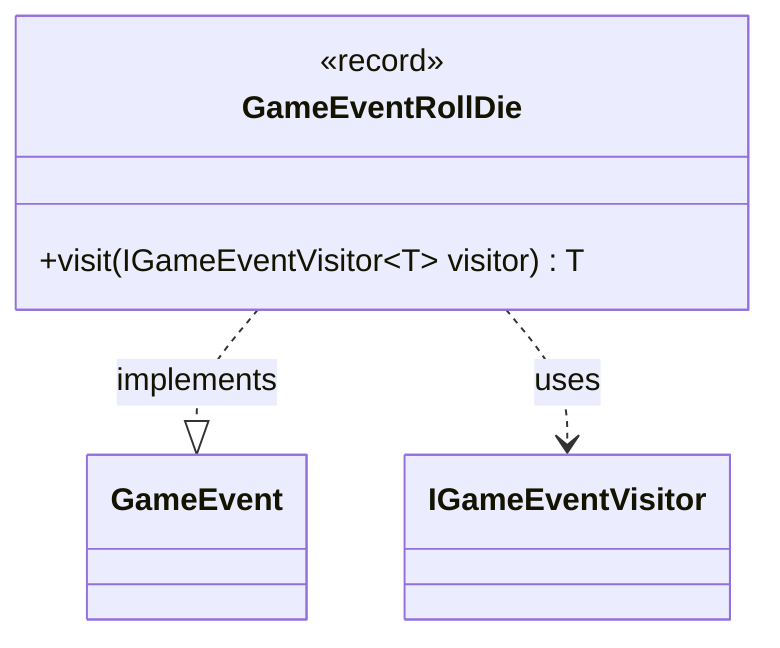

---
aliases:
  - GameEventRollDie
tags:
  - java/record
  - module/forge-game
  - pkg/forge/game/event
fqn: forge.game.event.GameEventRollDie
package: forge.game.event
module: forge-game
kind: Record
---

# GameEventRollDie

**Package:** `forge.game.event`   **Module:** `forge-game`   **Kind:** Record



## Relationships
**Implements:**
- [[forge.game.event.GameEvent|GameEvent]]
**Uses:**
- [[forge.game.event.IGameEventVisitor|IGameEventVisitor]]

## Design Description

GameEventRollDie is an immutable, parameterless record signaling that a die has been rolled within the game. As one of many concrete event types implementing the `GameEvent` interface, it carries no state of its own—its existence is the notification. It participates in a visitor-pattern dispatch: its `visit` method accepts a generic `IGameEventVisitor<T>` and routes back through `visitor.visit(this)`, letting observers handle this specific event type without the event itself knowing how it will be processed. Using a record makes the design intent explicit: this is a lightweight, value-based message in the engine's event system, decoupling the producers of die-roll events from the subscribers that react to them.

## Source
`forge-game/src/main/java/forge/game/event/GameEventRollDie.java`

```java
package forge.game.event;

public record GameEventRollDie() implements GameEvent {

    @Override
    public <T> T visit(IGameEventVisitor<T> visitor) {
        return visitor.visit(this);
    }
}
```

## Python
`forge/game/event/GameEventRollDie.py`

```python
package GameEventRollDie
```
