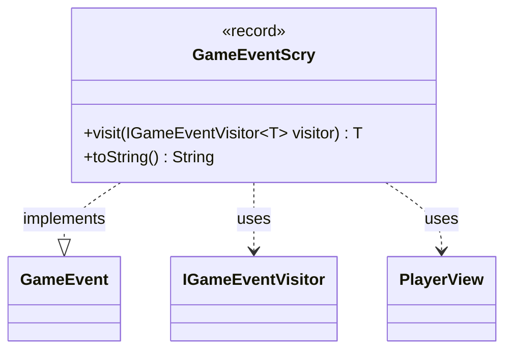

---
aliases:
  - GameEventScry
tags:
  - java/record
  - module/forge-game
  - pkg/forge/game/event
fqn: forge.game.event.GameEventScry
package: forge.game.event
module: forge-game
kind: Record
---

# GameEventScry

**Package:** `forge.game.event` &nbsp; **Module:** `forge-game` &nbsp; **Kind:** Record



## Relationships
**Implements:**
- [[forge.game.event.GameEvent|GameEvent]]
**Uses:**
- [[forge.game.event.IGameEventVisitor|IGameEventVisitor]]
- [[forge.game.player.PlayerView|PlayerView]]

## Design Description

GameEventScry is an immutable record representing the domain event fired when a player resolves a Scry action, capturing the player (as a `PlayerView`) along with how many cards were placed on top of and bottom of the library. As a `GameEvent`, it participates in the engine's event-dispatch system through the visitor pattern: its `visit` method double-dispatches to an `IGameEventVisitor`, letting consumers handle each event type without the event itself knowing their concrete logic. The record form enforces immutability and supplies the component accessors, while the overridden `toString` yields a human-readable summary of the scry outcome for logging or display. It is a lightweight, data-only notification with no game logic of its own.

## Source
`forge-game/src/main/java/forge/game/event/GameEventScry.java`

```java
package forge.game.event;

import forge.game.player.PlayerView;

public record GameEventScry(PlayerView player, int toTop, int toBottom) implements GameEvent {

    @Override
    public <T> T visit(IGameEventVisitor<T> visitor) {
        return visitor.visit(this);
    }

    /* (non-Javadoc)
     * @see java.lang.Object#toString()
     */
    @Override
    public String toString() {
        return "" + player + " scried " + toTop + " to top, " + toBottom + " to bottom";
    }
}
```
