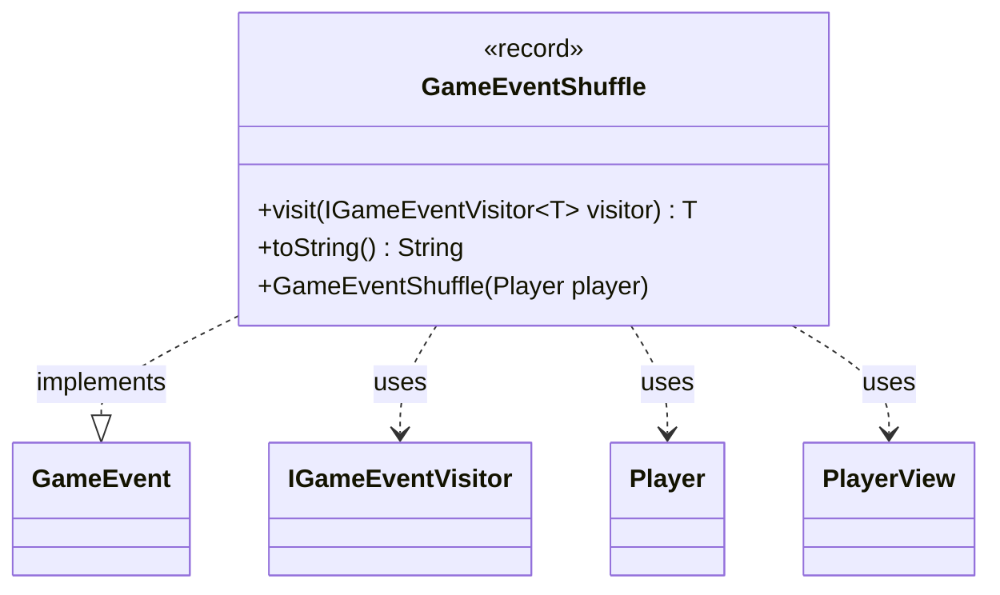

---
aliases:
  - GameEventShuffle
tags:
  - java/record
  - module/forge-game
  - pkg/forge/game/event
fqn: forge.game.event.GameEventShuffle
package: forge.game.event
module: forge-game
kind: Record
---

# GameEventShuffle

**Package:** `forge.game.event`   **Module:** `forge-game`   **Kind:** Record



## Relationships
**Implements:**
- [[forge.game.event.GameEvent|GameEvent]]
**Uses:**
- [[forge.game.event.IGameEventVisitor|IGameEventVisitor]]
- [[forge.game.player.Player|Player]]
- [[forge.game.player.PlayerView|PlayerView]]

## Design Description

GameEventShuffle is an immutable event record signaling that a player has shuffled their library. As a `GameEvent` implementation, it participates in the engine's visitor-based event-dispatch mechanism: its `visit` method double-dispatches to an `IGameEventVisitor`, letting observers (UI, AI, logging) react without the event itself knowing their concrete types. The record's single component is a `PlayerView`—a lightweight, view-layer snapshot of the player—rather than the live `Player`; a convenience constructor accepts a `Player` and converts it via `PlayerView.get`, decoupling event consumers from mutable game state. The overridden `toString` builds a human-readable message (e.g. "Alice shuffles their library") using `Lang` and `TextUtil` for grammatically correct, localizable phrasing.

## Source
`forge-game/src/main/java/forge/game/event/GameEventShuffle.java`

```java
package forge.game.event;

import forge.game.player.Player;
import forge.game.player.PlayerView;
import forge.util.Lang;
import forge.util.TextUtil;

public record GameEventShuffle(PlayerView player) implements GameEvent {

    public GameEventShuffle(Player player) {
        this(PlayerView.get(player));
    }

    @Override
    public <T> T visit(IGameEventVisitor<T> visitor) {
        return visitor.visit(this);
    }

    /* (non-Javadoc)
     * @see java.lang.Object#toString()
     */
    @Override
    public String toString() {
        return TextUtil.concatWithSpace(player.toString(), Lang.joinVerb(player.getName(), "shuffle"), "their library");
    }
}
```

## Python
`forge/game/event/GameEventShuffle.py`

```python
from forge.game.player.Player import Player
from forge.game.player.PlayerView import PlayerView
from forge.util.Lang import Lang
from forge.util.TextUtil import TextUtil
from forge.game.event.GameEvent import GameEvent
from forge.game.event.IGameEventVisitor import IGameEventVisitor


class GameEventShuffle(GameEvent):
    def __init__(self, player):
        if isinstance(player, Player):
            self.player = PlayerView.get(player)
        else:
            self.player = player

    def visit(self, visitor):
        return visitor.visit(self)

    def __str__(self):
        return TextUtil.concatWithSpace(str(self.player), Lang.joinVerb(self.player.getName(), "shuffle"), "their library")

    def toString(self):
        return self.__str__()
```
