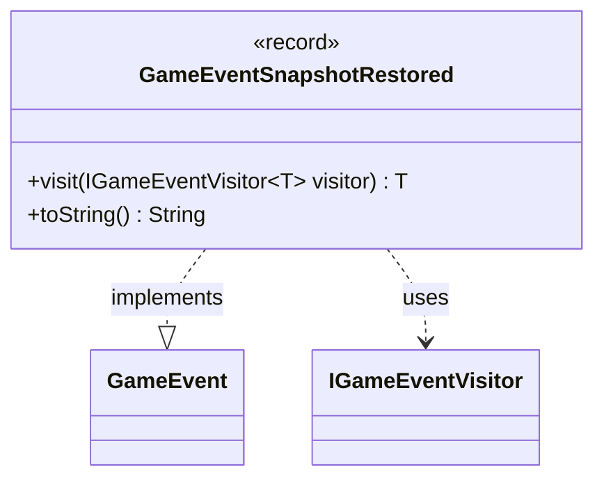

---
aliases:
  - GameEventSnapshotRestored
tags:
  - java/record
  - module/forge-game
  - pkg/forge/game/event
fqn: forge.game.event.GameEventSnapshotRestored
package: forge.game.event
module: forge-game
kind: Record
---

# GameEventSnapshotRestored

**Package:** `forge.game.event` &nbsp; **Module:** `forge-game` &nbsp; **Kind:** Record



## Relationships
**Implements:**
- [[forge.game.event.GameEvent|GameEvent]]
**Uses:**
- [[forge.game.event.IGameEventVisitor|IGameEventVisitor]]

## Design Description

Forge dispatches game events through a visitor pattern, and `GameEventSnapshotRestored` is one concrete event in that hierarchy. As a record implementing the `GameEvent` interface, it signals that an undo-snapshot restoration is taking place, carrying a single `start` flag that distinguishes the beginning of a restoration from its completion. Its compact record form makes it an immutable, value-based notification with no behavior beyond reporting.

The class participates in double dispatch via `visit`, accepting an `IGameEventVisitor<T>` and routing back to the visitor's type-specific overload so listeners can handle this event without instanceof checks. The overridden `toString` yields a human-readable label ("Undo Snapshot Restoration Started" or "Undo Snapshot Restored") driven by the `start` flag, intended for logging or display. This reflects the package's broader design intent: lightweight, self-describing event objects decoupled from the subsystems that consume them.

## Source
`forge-game/src/main/java/forge/game/event/GameEventSnapshotRestored.java`

```java
package forge.game.event;

import forge.util.TextUtil;

public record GameEventSnapshotRestored(boolean start) implements GameEvent {

    @Override
    public <T> T visit(IGameEventVisitor<T> visitor) {
        return visitor.visit(this);
    }

    @Override
    public String toString() {
        if (start) {
            return TextUtil.concatWithSpace("Undo Snapshot Restoration Started");
        }

        return TextUtil.concatWithSpace("Undo Snapshot Restored");
    }
}
```

## Python
`forge/game/event/GameEventSnapshotRestored.py`

```python
package forge.game.event;

from forge.util.TextUtil import TextUtil
from forge.game.event.GameEvent import GameEvent
from forge.game.event.IGameEventVisitor import IGameEventVisitor


class GameEventSnapshotRestored(GameEvent):
    def __init__(self, start: bool):
        self.start = start

    def visit(self, visitor: IGameEventVisitor):
        return visitor.visit(self)

    def __str__(self) -> str:
        if self.start:
            return TextUtil.concatWithSpace("Undo Snapshot Restoration Started")

        return TextUtil.concatWithSpace("Undo Snapshot Restored")
```
