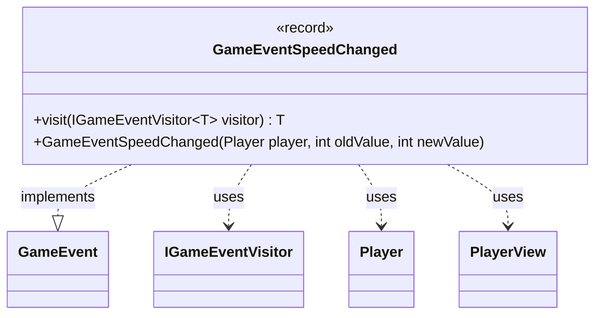

---
aliases:
  - GameEventSpeedChanged
tags:
  - java/record
  - module/forge-game
  - pkg/forge/game/event
fqn: forge.game.event.GameEventSpeedChanged
package: forge.game.event
module: forge-game
kind: Record
---

# GameEventSpeedChanged

**Package:** `forge.game.event` &nbsp; **Module:** `forge-game` &nbsp; **Kind:** Record



## Relationships
**Implements:**
- [[forge.game.event.GameEvent|GameEvent]]
**Uses:**
- [[forge.game.event.IGameEventVisitor|IGameEventVisitor]]
- [[forge.game.player.Player|Player]]
- [[forge.game.player.PlayerView|PlayerView]]

## Design Description

GameEventSpeedChanged is an immutable record that signals a change to a player's "speed" value, carrying the affected player along with its previous and new integer values. As a concrete event type, it implements the GameEvent interface and participates in the engine's visitor-based event-dispatch mechanism: its `visit` method double-dispatches to an IGameEventVisitor, letting each observer handle the event without the event itself knowing the handling logic.

Notably, the canonical component stores a PlayerView rather than a live Player, decoupling event consumers (such as the UI) from mutable game state. A convenience constructor accepts a Player and converts it via `PlayerView.get`, so producers can fire the event with the domain object while subscribers receive only the safe, read-only view.

## Source
`forge-game/src/main/java/forge/game/event/GameEventSpeedChanged.java`

```java
package forge.game.event;

import forge.game.player.Player;
import forge.game.player.PlayerView;

public record GameEventSpeedChanged(PlayerView player, int oldValue, int newValue) implements GameEvent {

    public GameEventSpeedChanged(Player player, int oldValue, int newValue) {
        this(PlayerView.get(player), oldValue, newValue);
    }

    @Override
    public <T> T visit(IGameEventVisitor<T> visitor) {
        return visitor.visit(this);
    }
}
```

## Python
`forge/game/event/GameEventSpeedChanged.py`

```python
from forge.game.player.Player import Player
from forge.game.player.PlayerView import PlayerView
from forge.game.event.GameEvent import GameEvent
from forge.game.event.IGameEventVisitor import IGameEventVisitor


class GameEventSpeedChanged(GameEvent):

    def __init__(self, player, oldValue: int, newValue: int):
        # Canonical record component stores a PlayerView; the convenience
        # constructor accepts a Player and converts it via PlayerView.get.
        if isinstance(player, Player):
            self.player = PlayerView.get(player)
        else:
            self.player = player
        self.oldValue = oldValue
        self.newValue = newValue

    def visit(self, visitor: IGameEventVisitor):
        return visitor.visit(self)
```
