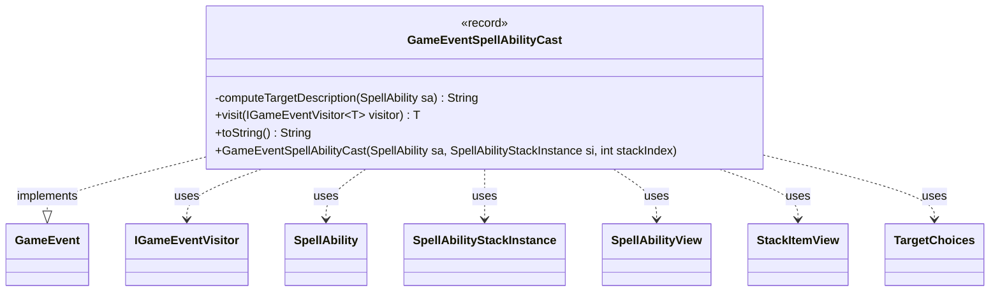

---
aliases:
  - GameEventSpellAbilityCast
tags:
  - java/record
  - module/forge-game
  - pkg/forge/game/event
fqn: forge.game.event.GameEventSpellAbilityCast
package: forge.game.event
module: forge-game
kind: Record
---

# GameEventSpellAbilityCast

**Package:** `forge.game.event` &nbsp; **Module:** `forge-game` &nbsp; **Kind:** Record



## Relationships
**Implements:**
- [[forge.game.event.GameEvent|GameEvent]]
**Uses:**
- [[forge.game.event.IGameEventVisitor|IGameEventVisitor]]
- [[forge.game.spellability.SpellAbility|SpellAbility]]
- [[forge.game.spellability.SpellAbilityStackInstance|SpellAbilityStackInstance]]
- [[forge.game.spellability.SpellAbilityView|SpellAbilityView]]
- [[forge.game.spellability.StackItemView|StackItemView]]
- [[forge.game.spellability.TargetChoices|TargetChoices]]

## Design Description

GameEventSpellAbilityCast is an immutable record that captures the moment a spell or ability is cast, activated, or triggered, serving as a notification object broadcast through Forge's game-event system. As a `GameEvent` implementation, it participates in the engine's visitor-based event dispatch: its `visit` method double-dispatches to an `IGameEventVisitor`, letting observers (typically UI or logging) react without the event needing to know their concrete types.

The record deliberately stores view-layer snapshots—`SpellAbilityView` and `StackItemView`—rather than live `SpellAbility`/`SpellAbilityStackInstance` objects, decoupling consumers from mutable game state. Its convenience constructor performs this conversion and eagerly computes a human-readable target description from the ability's `TargetChoices`, so the immutable payload is fully resolved at construction time. The `toString` override formats a readable cast/trigger/activate message for logs and event feeds.

## Source
`forge-game/src/main/java/forge/game/event/GameEventSpellAbilityCast.java`

```java
package forge.game.event;

import forge.game.spellability.SpellAbility;
import forge.game.spellability.SpellAbilityStackInstance;
import forge.game.spellability.SpellAbilityView;
import forge.game.spellability.StackItemView;
import forge.game.spellability.TargetChoices;

public record GameEventSpellAbilityCast(SpellAbilityView sa, StackItemView si, int stackIndex, String targetDescription) implements GameEvent {

    public GameEventSpellAbilityCast(SpellAbility sa, SpellAbilityStackInstance si, int stackIndex) {
        this(SpellAbilityView.get(sa), StackItemView.get(si), stackIndex, computeTargetDescription(sa));
    }

    private static String computeTargetDescription(SpellAbility sa) {
        if (sa.getTargetRestrictions() == null) return null;
        StringBuilder sb = new StringBuilder();
        for (TargetChoices ch : sa.getAllTargetChoices()) {
            if (ch != null) { if (sb.length() > 0) sb.append(" "); sb.append(ch); }
        }
        return sb.length() == 0 ? null : sb.toString();
    }

    /* (non-Javadoc)
     * @see forge.game.event.GameEvent#visit(forge.game.event.IGameEventVisitor)
     */
    @Override
    public <T> T visit(IGameEventVisitor<T> visitor) {
        return visitor.visit(this);
    }

    /* (non-Javadoc)
     * @see java.lang.Object#toString()
     */
    @Override
    public String toString() {
        return "" + si.getActivatingPlayer() + (sa.isSpell() ? " cast " : si.isTrigger() ? " triggered " : " activated ") + sa;
    }
}
```
