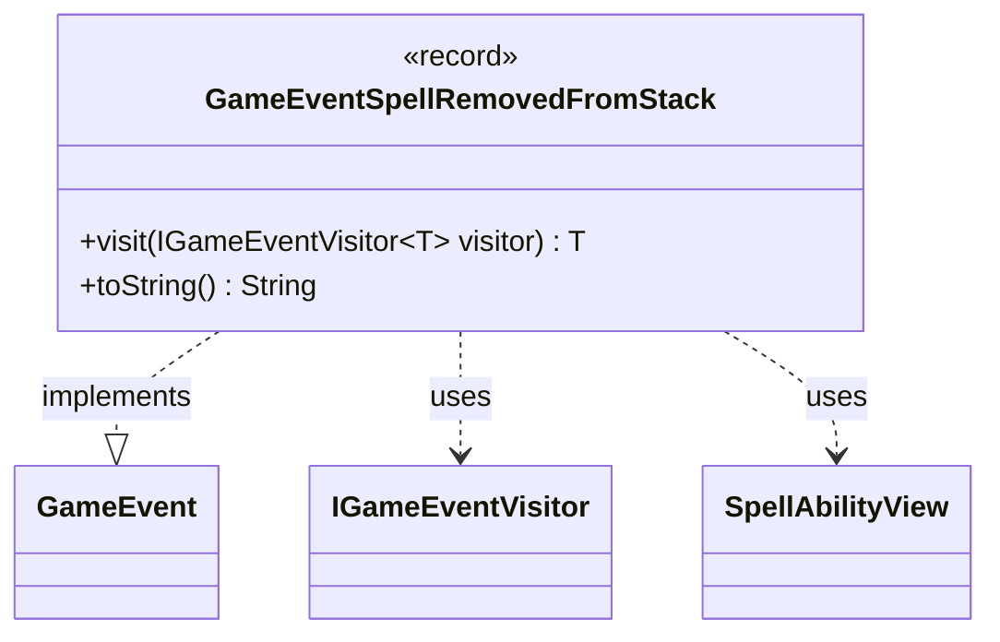

---
aliases:
  - GameEventSpellRemovedFromStack
tags:
  - java/record
  - module/forge-game
  - pkg/forge/game/event
fqn: forge.game.event.GameEventSpellRemovedFromStack
package: forge.game.event
module: forge-game
kind: Record
---

# GameEventSpellRemovedFromStack

**Package:** `forge.game.event` &nbsp; **Module:** `forge-game` &nbsp; **Kind:** Record



## Relationships
**Implements:**
- [[forge.game.event.GameEvent|GameEvent]]
**Uses:**
- [[forge.game.event.IGameEventVisitor|IGameEventVisitor]]
- [[forge.game.spellability.SpellAbilityView|SpellAbilityView]]

## Design Description

`GameEventSpellRemovedFromStack` is an immutable event record that signals a spell has been taken off the game's stack — for instance when a spell is countered, fizzles, or otherwise leaves without resolving normally. It carries a single `SpellAbilityView`, a read-only snapshot identifying the spell involved, keeping the event lightweight and decoupled from mutable game state.

As an implementation of the `GameEvent` interface, it participates in the engine's event system via the visitor pattern: its `visit` method dispatches to the appropriate `IGameEventVisitor` handler, allowing observers such as UI or AI components to react without the event hierarchy knowing their concrete types. The overridden `toString` yields a concise human-readable form for logging and debugging. Using a `record` makes the event's immutability and value semantics explicit, fitting its role as a transient notification.

## Source
`forge-game/src/main/java/forge/game/event/GameEventSpellRemovedFromStack.java`

```java
package forge.game.event;

import forge.game.spellability.SpellAbilityView;

public record GameEventSpellRemovedFromStack(SpellAbilityView sa) implements GameEvent {

    @Override
    public <T> T visit(IGameEventVisitor<T> visitor) {
        return visitor.visit(this);
    }

    /* (non-Javadoc)
     * @see java.lang.Object#toString()
     */
    @Override
    public String toString() {
        return "Stack removed " + sa;
    }
}
```
