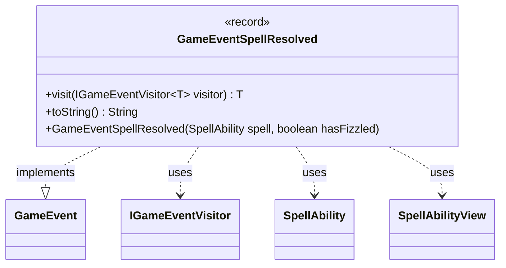

---
aliases:
  - GameEventSpellResolved
tags:
  - java/record
  - module/forge-game
  - pkg/forge/game/event
fqn: forge.game.event.GameEventSpellResolved
package: forge.game.event
module: forge-game
kind: Record
---

# GameEventSpellResolved

**Package:** `forge.game.event` &nbsp; **Module:** `forge-game` &nbsp; **Kind:** Record



## Relationships
**Implements:**
- [[forge.game.event.GameEvent|GameEvent]]
**Uses:**
- [[forge.game.event.IGameEventVisitor|IGameEventVisitor]]
- [[forge.game.spellability.SpellAbility|SpellAbility]]
- [[forge.game.spellability.SpellAbilityView|SpellAbilityView]]

## Design Description

GameEventSpellResolved is an immutable record that signals the completion of a spell or ability resolving on the stack. As one of many concrete implementations of the `GameEvent` interface, it participates in the engine's event-notification system, carrying a snapshot of the resolved spell (`SpellAbilityView`), whether it fizzled, and a cached stack description for display.

Its design reflects the visitor pattern: the `visit` method dispatches to an `IGameEventVisitor`, letting listeners react to spell resolution without the event needing to know their concrete types. Notably, the convenience constructor accepts a live `SpellAbility` but immediately converts it to a lightweight `SpellAbilityView` and extracts the stack description eagerly, decoupling the event from mutable game state so the snapshot stays stable after the spell leaves the stack. The custom `toString` yields a concise, fizzle-aware log line.

## Source
`forge-game/src/main/java/forge/game/event/GameEventSpellResolved.java`

```java
package forge.game.event;

import forge.game.spellability.SpellAbility;
import forge.game.spellability.SpellAbilityView;

public record GameEventSpellResolved(SpellAbilityView spell, boolean hasFizzled, String stackDescription) implements GameEvent {

    public GameEventSpellResolved(SpellAbility spell, boolean hasFizzled) {
        this(SpellAbilityView.get(spell), hasFizzled, spell.getStackDescription());
    }

    @Override
    public <T> T visit(IGameEventVisitor<T> visitor) {
        return visitor.visit(this);
    }

    /* (non-Javadoc)
     * @see java.lang.Object#toString()
     */
    @Override
    public String toString() {
        return "Stack resolved " + spell + (hasFizzled ? " (fizzled)" : "");
    }
}
```
