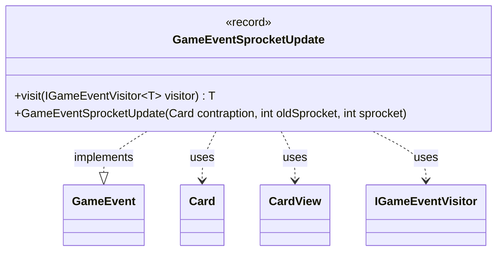

---
aliases:
  - GameEventSprocketUpdate
tags:
  - java/record
  - module/forge-game
  - pkg/forge/game/event
fqn: forge.game.event.GameEventSprocketUpdate
package: forge.game.event
module: forge-game
kind: Record
---

# GameEventSprocketUpdate

**Package:** `forge.game.event` &nbsp; **Module:** `forge-game` &nbsp; **Kind:** Record



## Relationships
**Implements:**
- [[forge.game.event.GameEvent|GameEvent]]
**Uses:**
- [[forge.game.card.Card|Card]]
- [[forge.game.card.CardView|CardView]]
- [[forge.game.event.IGameEventVisitor|IGameEventVisitor]]

## Design Description

GameEventSprocketUpdate is an immutable record that signals a change to a Contraption card's active sprocket, capturing the affected card (as a display-friendly `CardView`), its previous sprocket, and its new sprocket value. As a `GameEvent`, it serves as a lightweight, type-safe notification broadcast through the engine's event system so observers (such as the UI) can react to sprocket advancement.

It participates in the visitor pattern by implementing `visit`, dispatching itself to an `IGameEventVisitor<T>` and letting each visitor handle the event without the event needing knowledge of consumers. A convenience constructor accepts a domain `Card` and converts it to a `CardView` via `CardView.get`, decoupling event consumers from the mutable game model while keeping call sites concise.

## Source
`forge-game/src/main/java/forge/game/event/GameEventSprocketUpdate.java`

```java
package forge.game.event;

import forge.game.card.Card;
import forge.game.card.CardView;

public record GameEventSprocketUpdate(CardView contraption, int oldSprocket, int sprocket) implements GameEvent {

    public GameEventSprocketUpdate(Card contraption, int oldSprocket, int sprocket) {
        this(CardView.get(contraption), oldSprocket, sprocket);
    }

    @Override
    public <T> T visit(IGameEventVisitor<T> visitor) {
        return visitor.visit(this);
    }
}
```
