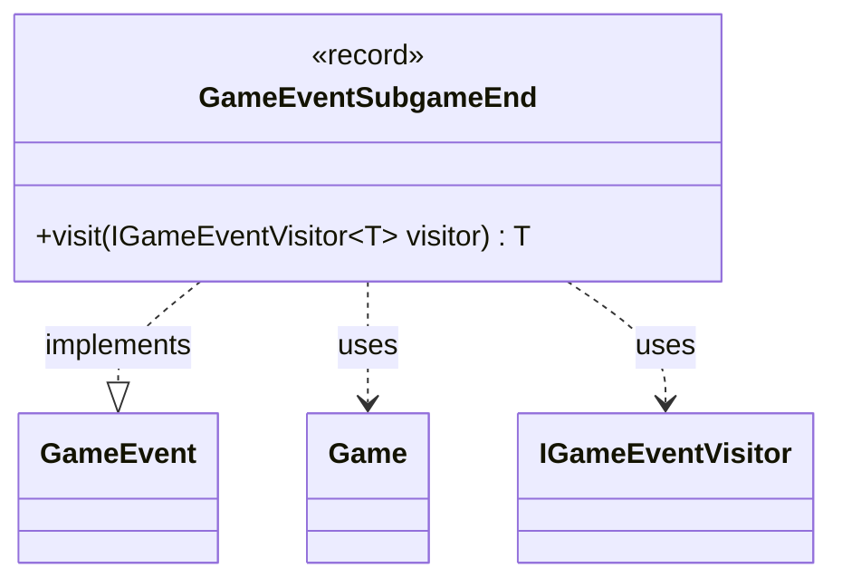

---
aliases:
  - GameEventSubgameEnd
tags:
  - java/record
  - module/forge-game
  - pkg/forge/game/event
fqn: forge.game.event.GameEventSubgameEnd
package: forge.game.event
module: forge-game
kind: Record
---

# GameEventSubgameEnd

**Package:** `forge.game.event` &nbsp; **Module:** `forge-game` &nbsp; **Kind:** Record



## Relationships
**Implements:**
- [[forge.game.event.GameEvent|GameEvent]]
**Uses:**
- [[forge.game.Game|Game]]
- [[forge.game.event.IGameEventVisitor|IGameEventVisitor]]

## Design Description

`GameEventSubgameEnd` is an immutable record that signals the conclusion of a subgame (a nested game such as those spawned by cards like Shahrazad), carrying a reference to the parent `maingame` and an explanatory `message`. As a concrete implementation of the `GameEvent` interface, it participates in the engine's event-notification system, allowing game state changes to be broadcast to interested observers without coupling them to event internals.

Its sole behavior is the generic `visit` method, which dispatches to the appropriate overload on an `IGameEventVisitor<T>`. This realizes the visitor pattern: rather than encoding handling logic itself, the event delegates to a visitor, enabling type-safe, return-valued processing and letting new event-consumers be added without modifying the event types. Using a record makes the event a lightweight, value-based carrier whose immutability suits safe propagation across the game engine.

## Source
`forge-game/src/main/java/forge/game/event/GameEventSubgameEnd.java`

```java
package forge.game.event;

import forge.game.Game;

public record GameEventSubgameEnd(Game maingame, String message) implements GameEvent {
    @Override
    public <T> T visit(IGameEventVisitor<T> visitor) {
        return visitor.visit(this);
    }
}
```
