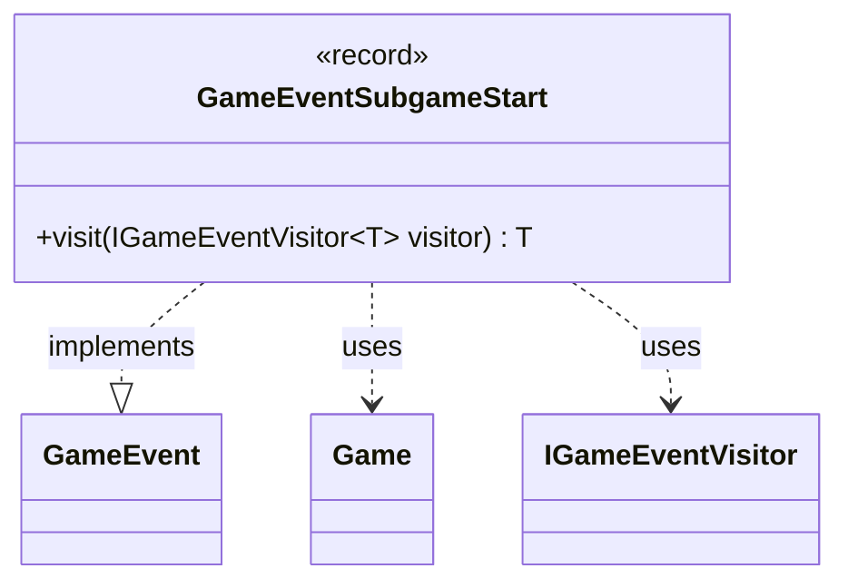

---
aliases:
  - GameEventSubgameStart
tags:
  - java/record
  - module/forge-game
  - pkg/forge/game/event
fqn: forge.game.event.GameEventSubgameStart
package: forge.game.event
module: forge-game
kind: Record
---

# GameEventSubgameStart

**Package:** `forge.game.event` &nbsp; **Module:** `forge-game` &nbsp; **Kind:** Record



## Relationships
**Implements:**
- [[forge.game.event.GameEvent|GameEvent]]
**Uses:**
- [[forge.game.Game|Game]]
- [[forge.game.event.IGameEventVisitor|IGameEventVisitor]]

## Design Description

`GameEventSubgameStart` is an immutable record that signals the beginning of a subgame (such as the games-within-a-game created by cards like Shahrazad) within the Forge engine's event system. It carries the `Game` instance representing the subgame and an accompanying `message` string describing the transition.

As an implementation of the `GameEvent` interface, it participates in the visitor pattern: its `visit` method dispatches to the appropriate overload on a generic `IGameEventVisitor<T>`, allowing observers to react to the event in a type-safe manner without the event needing to know their concrete behavior. Modeling the event as a record reflects clear design intent—the event is a lightweight, value-based notification whose equality, accessors, and construction are derived automatically, keeping it a pure carrier of immutable state decoupled from any handling logic.

## Source
`forge-game/src/main/java/forge/game/event/GameEventSubgameStart.java`

```java
package forge.game.event;

import forge.game.Game;

public record GameEventSubgameStart(Game subgame, String message) implements GameEvent {

    @Override
    public <T> T visit(IGameEventVisitor<T> visitor) {
        return visitor.visit(this);
    }
}
```
