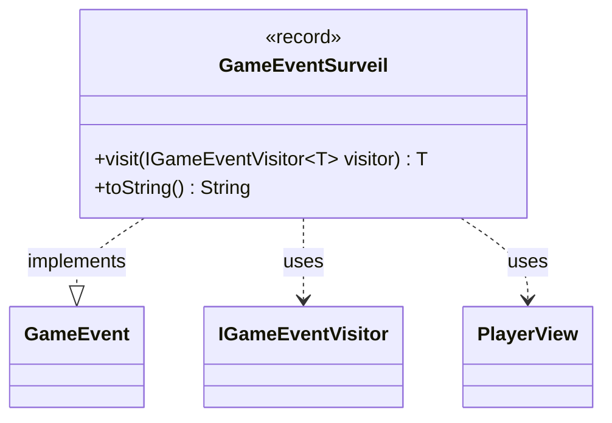

---
aliases:
  - GameEventSurveil
tags:
  - java/record
  - module/forge-game
  - pkg/forge/game/event
fqn: forge.game.event.GameEventSurveil
package: forge.game.event
module: forge-game
kind: Record
---

# GameEventSurveil

**Package:** `forge.game.event` &nbsp; **Module:** `forge-game` &nbsp; **Kind:** Record



## Relationships
**Implements:**
- [[forge.game.event.GameEvent|GameEvent]]
**Uses:**
- [[forge.game.event.IGameEventVisitor|IGameEventVisitor]]
- [[forge.game.player.PlayerView|PlayerView]]

## Design Description

GameEventSurveil is an immutable event record in Forge's game-event system, capturing the outcome of a surveil action: which player surveilled and how many cards were sent to the library versus the graveyard. As a record implementing GameEvent, it carries this data as final, value-based fields and serves purely as a notification payload broadcast to interested listeners.

It participates in a visitor-pattern dispatch: its `visit` method forwards to the type-specific overload on `IGameEventVisitor`, letting handlers process the event without instanceof checks and keeping event data decoupled from event handling. It collaborates with `PlayerView` to identify the acting player through the view layer rather than the core model, and overrides `toString` to produce a human-readable summary for logging or display.

## Source
`forge-game/src/main/java/forge/game/event/GameEventSurveil.java`

```java
package forge.game.event;

import forge.game.player.PlayerView;

public record GameEventSurveil(PlayerView player, int toLibrary, int toGraveyard) implements GameEvent {

    @Override
    public <T> T visit(IGameEventVisitor<T> visitor) {
        return visitor.visit(this);
    }

    /* (non-Javadoc)
     * @see java.lang.Object#toString()
     */
    @Override
    public String toString() {
        return "" + player + " surveilled " + toLibrary + " to library, " + toGraveyard + " to graveyard";
    }
}
```
