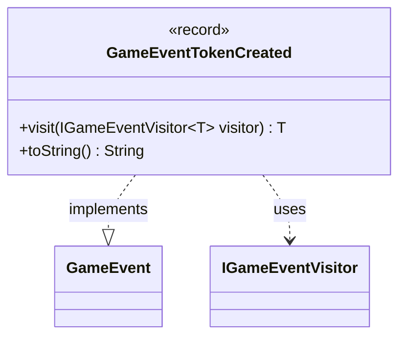

---
aliases:
  - GameEventTokenCreated
tags:
  - java/record
  - module/forge-game
  - pkg/forge/game/event
fqn: forge.game.event.GameEventTokenCreated
package: forge.game.event
module: forge-game
kind: Record
---

# GameEventTokenCreated

**Package:** `forge.game.event` &nbsp; **Module:** `forge-game` &nbsp; **Kind:** Record



## Relationships
**Implements:**
- [[forge.game.event.GameEvent|GameEvent]]
**Uses:**
- [[forge.game.event.IGameEventVisitor|IGameEventVisitor]]

## Design Description

`GameEventTokenCreated` is an immutable, parameterless record that signals the creation of a token onto the battlefield within the forge-game module's event system. As a concrete implementation of the `GameEvent` interface, it participates in a visitor-based dispatch scheme: its `visit` method forwards to the appropriate overload on an `IGameEventVisitor<T>`, letting listeners react to token creation without the event itself carrying any behavior or state.

The design favors lightweight, self-describing notification — the record carries no payload, so it merely announces that *some* token was created, and overrides `toString` to yield the human-readable label "Token created" for logging or debugging. Choosing a record makes the type concise and inherently immutable, fitting its role as a transient signal broadcast through Forge's game-event pipeline.

## Source
`forge-game/src/main/java/forge/game/event/GameEventTokenCreated.java`

```java
package forge.game.event;

public record GameEventTokenCreated() implements GameEvent {

    @Override
    public <T> T visit(IGameEventVisitor<T> visitor) {
        return visitor.visit(this);
    }

    /* (non-Javadoc)
     * @see java.lang.Object#toString()
     */
    @Override
    public String toString() {
        return "Token created";
    }
}
```
