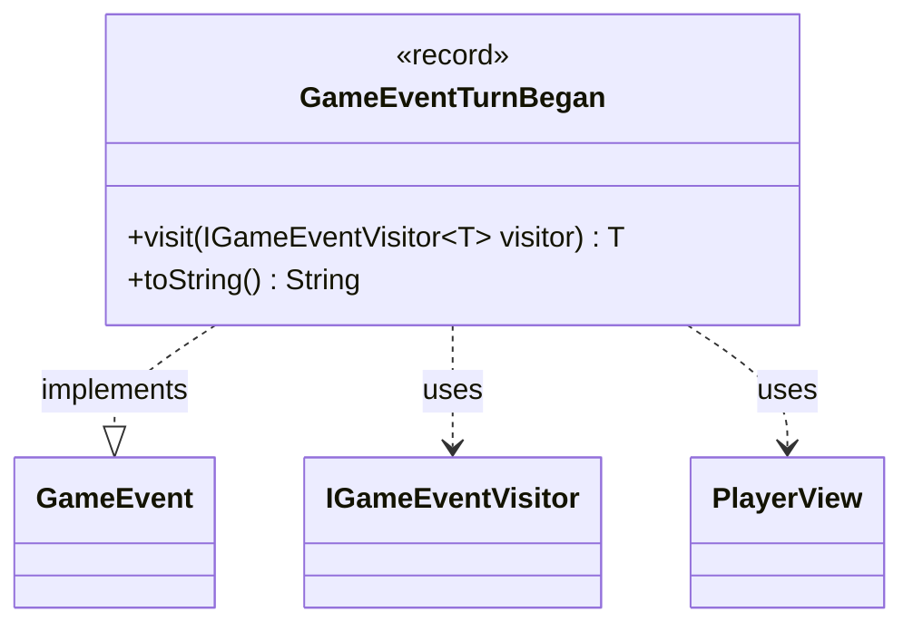

---
aliases:
  - GameEventTurnBegan
tags:
  - java/record
  - module/forge-game
  - pkg/forge/game/event
fqn: forge.game.event.GameEventTurnBegan
package: forge.game.event
module: forge-game
kind: Record
---

# GameEventTurnBegan

**Package:** `forge.game.event` &nbsp; **Module:** `forge-game` &nbsp; **Kind:** Record



## Relationships
**Implements:**
- [[forge.game.event.GameEvent|GameEvent]]
**Uses:**
- [[forge.game.event.IGameEventVisitor|IGameEventVisitor]]
- [[forge.game.player.PlayerView|PlayerView]]

## Design Description

`GameEventTurnBegan` is an immutable record capturing the moment a player's turn begins, carrying the turn's owner (`PlayerView`) and its sequential turn number. As a concrete event in `forge.game.event`, it implements the `GameEvent` interface, slotting into the engine's event-notification system so observers can react to turn transitions without coupling to game internals.

It participates in a double-dispatch visitor pattern: its `visit` method forwards to the supplied `IGameEventVisitor`, letting visitors handle each event subtype in a type-safe, generic way while keeping per-event logic external to the event itself. The overridden `toString` builds a concise human-readable label (e.g., "Turn 3 (Alice)") via `TextUtil` helpers, reflecting an intent to support logging and display. Choosing a record makes the event a lightweight, value-based, thread-safe payload.

## Source
`forge-game/src/main/java/forge/game/event/GameEventTurnBegan.java`

```java
package forge.game.event;

import forge.game.player.PlayerView;
import forge.util.TextUtil;

public record GameEventTurnBegan(PlayerView turnOwner, int turnNumber) implements GameEvent {

    @Override
    public <T> T visit(IGameEventVisitor<T> visitor) {
        return visitor.visit(this);
    }

    /* (non-Javadoc)
     * @see java.lang.Object#toString()
     */
    @Override
    public String toString() {
        return TextUtil.concatWithSpace("Turn", String.valueOf(turnNumber), TextUtil.enclosedParen(turnOwner.toString()));
    }
}
```

## Python
`forge/game/event/GameEventTurnBegan.py`

```python
from forge.game.event.GameEvent import GameEvent
from forge.game.event.IGameEventVisitor import IGameEventVisitor
from forge.game.player.PlayerView import PlayerView
from forge.util.TextUtil import TextUtil


class GameEventTurnBegan(GameEvent):

    def __init__(self, turnOwner: PlayerView, turnNumber: int):
        self.turnOwner = turnOwner
        self.turnNumber = turnNumber

    def visit(self, visitor: IGameEventVisitor):
        return visitor.visit(self)

    def toString(self) -> str:
        return TextUtil.concatWithSpace("Turn", str(self.turnNumber), TextUtil.enclosedParen(self.turnOwner.toString()))
```
