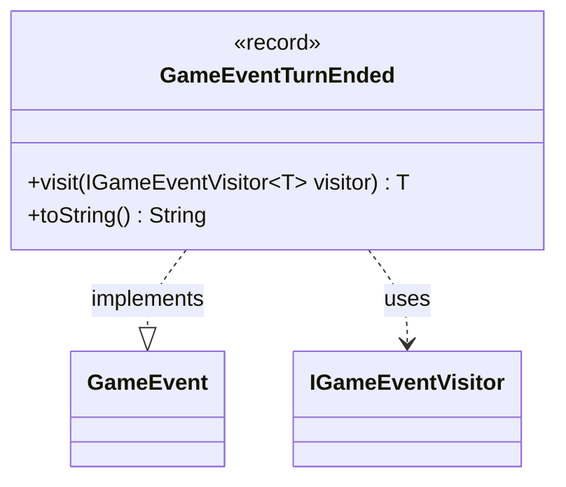

---
aliases:
  - GameEventTurnEnded
tags:
  - java/record
  - module/forge-game
  - pkg/forge/game/event
fqn: forge.game.event.GameEventTurnEnded
package: forge.game.event
module: forge-game
kind: Record
---

# GameEventTurnEnded

**Package:** `forge.game.event` &nbsp; **Module:** `forge-game` &nbsp; **Kind:** Record



## Relationships
**Implements:**
- [[forge.game.event.GameEvent|GameEvent]]
**Uses:**
- [[forge.game.event.IGameEventVisitor|IGameEventVisitor]]

## Design Description

A record representing the event fired when a turn ends in the game. As a parameterless record implementing `GameEvent`, it serves as an immutable, zero-state notification within Forge's event system, signaling that the active turn has concluded.

It participates in a visitor pattern: its `visit` method dispatches to the generic `IGameEventVisitor<T>`, letting handlers process the event without the class knowing their concrete types. The empty record body reflects that no payload is needed—the event's mere occurrence carries all meaning—while the overridden `toString` returns a fixed "Turn ended" label for logging and debugging. This design keeps turn-end signaling lightweight and decoupled from its consumers.

## Source
`forge-game/src/main/java/forge/game/event/GameEventTurnEnded.java`

```java
package forge.game.event;

public record GameEventTurnEnded() implements GameEvent {

    @Override
    public <T> T visit(IGameEventVisitor<T> visitor) {
        return visitor.visit(this);
    }

    /* (non-Javadoc)
     * @see java.lang.Object#toString()
     */
    @Override
    public String toString() {
        return "Turn ended";
    }
}
```
