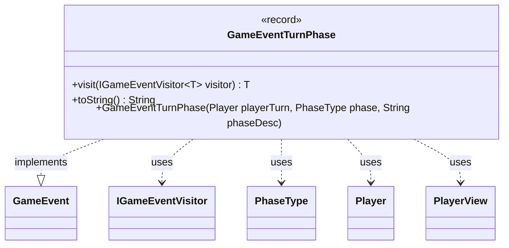

---
aliases:
  - GameEventTurnPhase
tags:
  - java/record
  - module/forge-game
  - pkg/forge/game/event
fqn: forge.game.event.GameEventTurnPhase
package: forge.game.event
module: forge-game
kind: Record
---

# GameEventTurnPhase

**Package:** `forge.game.event` &nbsp; **Module:** `forge-game` &nbsp; **Kind:** Record



## Relationships
**Implements:**
- [[forge.game.event.GameEvent|GameEvent]]
**Uses:**
- [[forge.game.event.IGameEventVisitor|IGameEventVisitor]]
- [[forge.game.phase.PhaseType|PhaseType]]
- [[forge.game.player.Player|Player]]
- [[forge.game.player.PlayerView|PlayerView]]

## Design Description

GameEventTurnPhase is an immutable record that signals a transition in the game's turn structure, carrying the active player's view, the `PhaseType` being entered, and a human-readable phase description. As one of many concrete `GameEvent` types, it participates in the engine's event-notification system, allowing UI and game components to react to phase changes without tight coupling.

Following the visitor pattern, it implements `visit` by dispatching to the appropriate `IGameEventVisitor` overload, letting visitors handle each event kind in a type-safe manner. A convenience constructor accepts a full `Player` and normalizes it to a serialization-friendly `PlayerView`, decoupling event payloads from live game objects. The overridden `toString` composes a localized, possessive-formatted label (via `Lang` and `TextUtil`) describing whose turn and which phase is active, intended for display purposes.

## Source
`forge-game/src/main/java/forge/game/event/GameEventTurnPhase.java`

```java
package forge.game.event;

import forge.game.phase.PhaseType;
import forge.game.player.Player;
import forge.game.player.PlayerView;
import forge.util.Lang;
import forge.util.TextUtil;

public record GameEventTurnPhase(PlayerView playerTurn, PhaseType phase, String phaseDesc) implements GameEvent {

    public GameEventTurnPhase(Player playerTurn, PhaseType phase, String phaseDesc) {
        this(PlayerView.get(playerTurn), phase, phaseDesc);
    }

    @Override
    public <T> T visit(IGameEventVisitor<T> visitor) {
        return visitor.visit(this);
    }

    @Override
    public String toString() {
        String playerName = Lang.getInstance().getPossesive(playerTurn.getName());
        return TextUtil.concatWithSpace(playerName,"turn,", phaseDesc+phase.nameForUi, "phase");
    }
}
```

## Python
`forge/game/event/GameEventTurnPhase.py`

```python
package = forge.game.event, module forge/game/event/GameEventTurnPhase.py

Let me write the port.

Dependencies: GameEvent, IGameEventVisitor, PhaseType, Player, PlayerView, Lang, TextUtil.

Lang and TextUtil are forge.util.Lang, forge.util.TextUtil from Java imports.from forge.game.event.GameEvent import GameEvent
from forge.game.event.IGameEventVisitor import IGameEventVisitor
from forge.game.phase.PhaseType import PhaseType
from forge.game.player.Player import Player
from forge.game.player.PlayerView import PlayerView
from forge.util.Lang import Lang
from forge.util.TextUtil import TextUtil


class GameEventTurnPhase(GameEvent):

    def __init__(self, playerTurn, phase: PhaseType, phaseDesc: str):
        if isinstance(playerTurn, Player):
            self.playerTurn = PlayerView.get(playerTurn)
        else:
            self.playerTurn = playerTurn
        self.phase = phase
        self.phaseDesc = phaseDesc

    def visit(self, visitor: IGameEventVisitor):
        return visitor.visit(self)

    def __str__(self) -> str:
        playerName = Lang.getInstance().getPossesive(self.playerTurn.getName())
        return TextUtil.concatWithSpace(playerName, "turn,", self.phaseDesc + self.phase.nameForUi, "phase")
```
