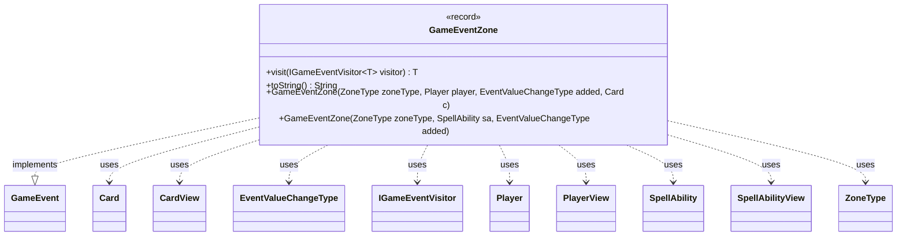

---
aliases:
  - GameEventZone
tags:
  - java/record
  - module/forge-game
  - pkg/forge/game/event
fqn: forge.game.event.GameEventZone
package: forge.game.event
module: forge-game
kind: Record
---

# GameEventZone

**Package:** `forge.game.event`   **Module:** `forge-game`   **Kind:** Record



## Relationships
**Implements:**
- [[forge.game.event.GameEvent|GameEvent]]
**Uses:**
- [[forge.game.card.Card|Card]]
- [[forge.game.card.CardView|CardView]]
- [[forge.game.event.EventValueChangeType|EventValueChangeType]]
- [[forge.game.event.IGameEventVisitor|IGameEventVisitor]]
- [[forge.game.player.Player|Player]]
- [[forge.game.player.PlayerView|PlayerView]]
- [[forge.game.spellability.SpellAbility|SpellAbility]]
- [[forge.game.spellability.SpellAbilityView|SpellAbilityView]]
- [[forge.game.zone.ZoneType|ZoneType]]

## Design Description

GameEventZone is an immutable record that models a domain event signalling a card or spell ability entering or leaving a game zone. As a concrete implementation of the `GameEvent` interface, it participates in Forge's visitor-based event dispatch, exposing `visit` to route itself to the appropriate `IGameEventVisitor` handler. It captures the affected `ZoneType`, the owning player, an `EventValueChangeType` mode indicating addition or removal, and the card or ability involved.

Notably, the record stores lightweight view types—`PlayerView`, `CardView`, and `SpellAbilityView`—rather than live model objects, and its convenience constructors translate the mutable `Player`, `Card`, and `SpellAbility` inputs into those snapshots. This decouples emitted events from the evolving game state, making them safe to hand to UI or observer layers. The overridden `toString` produces a human-readable summary, gracefully handling game-level events where no player, card, or ability is present.

## Source
`forge-game/src/main/java/forge/game/event/GameEventZone.java`

```java
package forge.game.event;

import forge.game.card.Card;
import forge.game.card.CardView;
import forge.game.player.Player;
import forge.game.player.PlayerView;
import forge.game.spellability.SpellAbility;
import forge.game.spellability.SpellAbilityView;
import forge.game.zone.ZoneType;
import forge.util.Lang;
import forge.util.TextUtil;

/**
 * Represents a game event related to a card or ability entering or leaving a zone.
 * Stores information about the affected zone, player, card, and spell ability.
 * Used for tracking zone changes such as casting, moving, or activating cards and abilities.
 */
public record GameEventZone(ZoneType zoneType, PlayerView player, EventValueChangeType mode, CardView card, SpellAbilityView sa) implements GameEvent {

    public GameEventZone(ZoneType zoneType, Player player, EventValueChangeType added, Card c) {
        this(zoneType, PlayerView.get(player), added, CardView.get(c), null);
    }

    public GameEventZone(ZoneType zoneType, SpellAbility sa, EventValueChangeType added) {
        this(zoneType, PlayerView.get(sa.getActivatingPlayer()), added, CardView.get(sa.getHostCard()), SpellAbilityView.get(sa));
    }

    @Override
    public <T> T visit(IGameEventVisitor<T> visitor) {
        return visitor.visit(this);
    }
    
    /* (non-Javadoc)
     * @see java.lang.Object#toString()
     */
    @Override
    public String toString() {
        String owners = player == null ? "Game" : Lang.getInstance().getPossesive(player.getName());
        return card == null && sa == null ?
            TextUtil.concatWithSpace(owners, zoneType.toString(), ":", mode.toString()) :
            TextUtil.concatWithSpace(owners, zoneType.toString(), ":", mode.toString(), "" + (sa == null ? card : sa));
    }

}
```

## Python
`forge/game/event/GameEventZone.py`

```python
from forge.game.card.Card import Card
from forge.game.card.CardView import CardView
from forge.game.event.GameEvent import GameEvent
from forge.game.event.EventValueChangeType import EventValueChangeType
from forge.game.event.IGameEventVisitor import IGameEventVisitor
from forge.game.player.Player import Player
from forge.game.player.PlayerView import PlayerView
from forge.game.spellability.SpellAbility import SpellAbility
from forge.game.spellability.SpellAbilityView import SpellAbilityView
from forge.game.zone.ZoneType import ZoneType
from forge.util.Lang import Lang
from forge.util.TextUtil import TextUtil


class GameEventZone(GameEvent):
    """
    Represents a game event related to a card or ability entering or leaving a zone.
    Stores information about the affected zone, player, card, and spell ability.
    Used for tracking zone changes such as casting, moving, or activating cards and abilities.
    """

    def __init__(self, zoneType: ZoneType, player, mode: EventValueChangeType, card=None, sa=None):
        # Convenience constructors translate mutable Player/Card/SpellAbility inputs
        # into their lightweight view snapshots.
        if isinstance(player, Player):
            # GameEventZone(zoneType, Player player, EventValueChangeType added, Card c)
            self.zoneType = zoneType
            self.player = PlayerView.get(player)
            self.mode = mode
            self.card = CardView.get(card)
            self.sa = None
        elif isinstance(player, SpellAbility):
            # GameEventZone(zoneType, SpellAbility sa, EventValueChangeType added)
            spell = player
            self.zoneType = zoneType
            self.player = PlayerView.get(spell.getActivatingPlayer())
            self.mode = mode
            self.card = CardView.get(spell.getHostCard())
            self.sa = SpellAbilityView.get(spell)
        else:
            # Canonical record constructor:
            # GameEventZone(ZoneType zoneType, PlayerView player, EventValueChangeType mode,
            #               CardView card, SpellAbilityView sa)
            self.zoneType = zoneType
            self.player = player
            self.mode = mode
            self.card = card
            self.sa = sa

    def visit(self, visitor: IGameEventVisitor):
        return visitor.visit(self)

    def __str__(self) -> str:
        owners = "Game" if self.player is None else Lang.getInstance().getPossesive(self.player.getName())
        if self.card is None and self.sa is None:
            return TextUtil.concatWithSpace(owners, self.zoneType.toString(), ":", self.mode.toString())
        return TextUtil.concatWithSpace(owners, self.zoneType.toString(), ":", self.mode.toString(),
                                        "" + str(self.card if self.sa is None else self.sa))

    def toString(self) -> str:
        return self.__str__()
```
