---
aliases:
  - Base
tags:
  - java/class
  - module/forge-game
  - pkg/forge/game/event
fqn: forge.game.event.IGameEventVisitor.Base
package: forge.game.event
module: forge-game
kind: Class
---

# Base

**Package:** `forge.game.event`   **Module:** `forge-game`   **Kind:** Class



```mermaid
classDiagram
    class Base {
        +visit(GameEventAnteCardsSelected event) T
        +visit(GameEventAttackersDeclared event) T
        +visit(GameEventBlockersDeclared event) T
        +visit(GameEventCardDamaged event) T
        +visit(GameEventCardDestroyed event) T
        +visit(GameEventCardAttachment event) T
        +visit(GameEventCardChangeZone event) T
        +visit(GameEventCardModeChosen event) T
        +visit(GameEventCardRegenerated event) T
        +visit(GameEventCardSacrificed event) T
        +visit(GameEventCardTapped event) T
        +visit(GameEventCardStatsChanged event) T
        +visit(GameEventCardCounters event) T
        +visit(GameEventCardPhased event) T
        +visit(GameEventCombatChanged event) T
        +visit(GameEventCombatEnded event) T
        +visit(GameEventCombatUpdate event) T
        +visit(GameEventGameFinished event) T
        +visit(GameEventGameOutcome event) T
        +visit(GameEventFlipCoin event) T
        +visit(GameEventGameStarted event) T
        +visit(GameEventGameRestarted event) T
        +visit(GameEventLandPlayed event) T
        +visit(GameEventPlayerLivesChanged event) T
        +visit(GameEventManaPool event) T
        +visit(GameEventManaBurn event) T
        +visit(GameEventMulligan event) T
        +visit(GameEventPlayerControl event) T
        +visit(GameEventPlayerCounters event) T
        +visit(GameEventPlayerPoisoned event) T
        +visit(GameEventPlayerRadiation event) T
        +visit(GameEventPlayerPriority event) T
        +visit(GameEventPlayerShardsChanged event) T
        +visit(GameEventPlayerStatsChanged event) T
        +visit(GameEventRandomLog event) T
        +visit(GameEventRollDie event) T
        +visit(GameEventScry event) T
        +visit(GameEventShuffle event) T
        +visit(GameEventSpeedChanged event) T
        +visit(GameEventSpellResolved event) T
        +visit(GameEventSpellAbilityCast event) T
        +visit(GameEventSpellRemovedFromStack event) T
        +visit(GameEventSprocketUpdate event) T
        +visit(GameEventSubgameStart event) T
        +visit(GameEventSubgameEnd event) T
        +visit(GameEventSurveil event) T
        +visit(GameEventTokenCreated event) T
        +visit(GameEventTurnBegan event) T
        +visit(GameEventTurnEnded event) T
        +visit(GameEventTurnPhase event) T
        +visit(GameEventPlayerDamaged event) T
        +visit(GameEventZone event) T
        +visit(GameEventCardForetold event) T
        +visit(GameEventCardPlotted event) T
        +visit(GameEventDayTimeChanged event) T
        +visit(GameEventDoorChanged event) T
        +visit(GameEventSnapshotRestored gameEventSnapshotRestored) T
        +visit(GameEventAddLog event) T
    }
    Base ..|> IGameEventVisitor : implements
    Base ..> GameEventAddLog : uses
    Base ..> GameEventAnteCardsSelected : uses
    Base ..> GameEventAttackersDeclared : uses
    Base ..> GameEventBlockersDeclared : uses
    Base ..> GameEventCardAttachment : uses
    Base ..> GameEventCardChangeZone : uses
    Base ..> GameEventCardCounters : uses
    Base ..> GameEventCardDamaged : uses
    Base ..> GameEventCardDestroyed : uses
    Base ..> GameEventCardForetold : uses
    Base ..> GameEventCardModeChosen : uses
    Base ..> GameEventCardPhased : uses
    Base ..> GameEventCardPlotted : uses
    Base ..> GameEventCardRegenerated : uses
    Base ..> GameEventCardSacrificed : uses
    Base ..> GameEventCardStatsChanged : uses
    Base ..> GameEventCardTapped : uses
    Base ..> GameEventCombatChanged : uses
    Base ..> GameEventCombatEnded : uses
    Base ..> GameEventCombatUpdate : uses
    Base ..> GameEventDayTimeChanged : uses
    Base ..> GameEventDoorChanged : uses
    Base ..> GameEventFlipCoin : uses
    Base ..> GameEventGameFinished : uses
    Base ..> GameEventGameOutcome : uses
    Base ..> GameEventGameRestarted : uses
    Base ..> GameEventGameStarted : uses
    Base ..> GameEventLandPlayed : uses
    Base ..> GameEventManaBurn : uses
    Base ..> GameEventManaPool : uses
    Base ..> GameEventMulligan : uses
    Base ..> GameEventPlayerControl : uses
    Base ..> GameEventPlayerCounters : uses
    Base ..> GameEventPlayerDamaged : uses
    Base ..> GameEventPlayerLivesChanged : uses
    Base ..> GameEventPlayerPoisoned : uses
    Base ..> GameEventPlayerPriority : uses
    Base ..> GameEventPlayerRadiation : uses
    Base ..> GameEventPlayerShardsChanged : uses
    Base ..> GameEventPlayerStatsChanged : uses
    Base ..> GameEventRandomLog : uses
    Base ..> GameEventRollDie : uses
    Base ..> GameEventScry : uses
    Base ..> GameEventShuffle : uses
    Base ..> GameEventSnapshotRestored : uses
    Base ..> GameEventSpeedChanged : uses
    Base ..> GameEventSpellAbilityCast : uses
    Base ..> GameEventSpellRemovedFromStack : uses
    Base ..> GameEventSpellResolved : uses
    Base ..> GameEventSprocketUpdate : uses
    Base ..> GameEventSubgameEnd : uses
    Base ..> GameEventSubgameStart : uses
    Base ..> GameEventSurveil : uses
    Base ..> GameEventTokenCreated : uses
    Base ..> GameEventTurnBegan : uses
    Base ..> GameEventTurnEnded : uses
    Base ..> GameEventTurnPhase : uses
    Base ..> GameEventZone : uses
```

## Relationships
**Implements:**
- [[forge.game.event.IGameEventVisitor|IGameEventVisitor]]
**Uses:**
- [[forge.game.event.GameEventAddLog|GameEventAddLog]]
- [[forge.game.event.GameEventAnteCardsSelected|GameEventAnteCardsSelected]]
- [[forge.game.event.GameEventAttackersDeclared|GameEventAttackersDeclared]]
- [[forge.game.event.GameEventBlockersDeclared|GameEventBlockersDeclared]]
- [[forge.game.event.GameEventCardAttachment|GameEventCardAttachment]]
- [[forge.game.event.GameEventCardChangeZone|GameEventCardChangeZone]]
- [[forge.game.event.GameEventCardCounters|GameEventCardCounters]]
- [[forge.game.event.GameEventCardDamaged|GameEventCardDamaged]]
- [[forge.game.event.GameEventCardDestroyed|GameEventCardDestroyed]]
- [[forge.game.event.GameEventCardForetold|GameEventCardForetold]]
- [[forge.game.event.GameEventCardModeChosen|GameEventCardModeChosen]]
- [[forge.game.event.GameEventCardPhased|GameEventCardPhased]]
- [[forge.game.event.GameEventCardPlotted|GameEventCardPlotted]]
- [[forge.game.event.GameEventCardRegenerated|GameEventCardRegenerated]]
- [[forge.game.event.GameEventCardSacrificed|GameEventCardSacrificed]]
- [[forge.game.event.GameEventCardStatsChanged|GameEventCardStatsChanged]]
- [[forge.game.event.GameEventCardTapped|GameEventCardTapped]]
- [[forge.game.event.GameEventCombatChanged|GameEventCombatChanged]]
- [[forge.game.event.GameEventCombatEnded|GameEventCombatEnded]]
- [[forge.game.event.GameEventCombatUpdate|GameEventCombatUpdate]]
- [[forge.game.event.GameEventDayTimeChanged|GameEventDayTimeChanged]]
- [[forge.game.event.GameEventDoorChanged|GameEventDoorChanged]]
- [[forge.game.event.GameEventFlipCoin|GameEventFlipCoin]]
- [[forge.game.event.GameEventGameFinished|GameEventGameFinished]]
- [[forge.game.event.GameEventGameOutcome|GameEventGameOutcome]]
- [[forge.game.event.GameEventGameRestarted|GameEventGameRestarted]]
- [[forge.game.event.GameEventGameStarted|GameEventGameStarted]]
- [[forge.game.event.GameEventLandPlayed|GameEventLandPlayed]]
- [[forge.game.event.GameEventManaBurn|GameEventManaBurn]]
- [[forge.game.event.GameEventManaPool|GameEventManaPool]]
- [[forge.game.event.GameEventMulligan|GameEventMulligan]]
- [[forge.game.event.GameEventPlayerControl|GameEventPlayerControl]]
- [[forge.game.event.GameEventPlayerCounters|GameEventPlayerCounters]]
- [[forge.game.event.GameEventPlayerDamaged|GameEventPlayerDamaged]]
- [[forge.game.event.GameEventPlayerLivesChanged|GameEventPlayerLivesChanged]]
- [[forge.game.event.GameEventPlayerPoisoned|GameEventPlayerPoisoned]]
- [[forge.game.event.GameEventPlayerPriority|GameEventPlayerPriority]]
- [[forge.game.event.GameEventPlayerRadiation|GameEventPlayerRadiation]]
- [[forge.game.event.GameEventPlayerShardsChanged|GameEventPlayerShardsChanged]]
- [[forge.game.event.GameEventPlayerStatsChanged|GameEventPlayerStatsChanged]]
- [[forge.game.event.GameEventRandomLog|GameEventRandomLog]]
- [[forge.game.event.GameEventRollDie|GameEventRollDie]]
- [[forge.game.event.GameEventScry|GameEventScry]]
- [[forge.game.event.GameEventShuffle|GameEventShuffle]]
- [[forge.game.event.GameEventSnapshotRestored|GameEventSnapshotRestored]]
- [[forge.game.event.GameEventSpeedChanged|GameEventSpeedChanged]]
- [[forge.game.event.GameEventSpellAbilityCast|GameEventSpellAbilityCast]]
- [[forge.game.event.GameEventSpellRemovedFromStack|GameEventSpellRemovedFromStack]]
- [[forge.game.event.GameEventSpellResolved|GameEventSpellResolved]]
- [[forge.game.event.GameEventSprocketUpdate|GameEventSprocketUpdate]]
- [[forge.game.event.GameEventSubgameEnd|GameEventSubgameEnd]]
- [[forge.game.event.GameEventSubgameStart|GameEventSubgameStart]]
- [[forge.game.event.GameEventSurveil|GameEventSurveil]]
- [[forge.game.event.GameEventTokenCreated|GameEventTokenCreated]]
- [[forge.game.event.GameEventTurnBegan|GameEventTurnBegan]]
- [[forge.game.event.GameEventTurnEnded|GameEventTurnEnded]]
- [[forge.game.event.GameEventTurnPhase|GameEventTurnPhase]]
- [[forge.game.event.GameEventZone|GameEventZone]]

## Design Description

The Base class is a no-op default implementation of the `IGameEventVisitor<T>` interface, embedded as a static nested class within `IGameEventVisitor`. As the comment states, it serves as the base class for all visitors in Forge's game-event Visitor pattern. It provides an empty `visit` overload for every concrete `GameEvent` subtype—covering card, combat, player, turn, mana, and game-lifecycle events—each simply returning `null`.

Its design intent is convenience: rather than forcing every concrete visitor to implement all ~60 `visit` methods, subclasses extend `Base` and override only the event types they care about, inheriting harmless defaults for the rest. The generic parameter `T` lets each visitor define its own return type, making the hierarchy reusable across both result-producing and side-effecting traversals of game events.

## Source
`forge-game/src/main/java/forge/game/event/IGameEventVisitor.java` — declaration excerpt

```java
    // This is base class for all visitors.
    class Base<T> implements IGameEventVisitor<T>{
        public T visit(GameEventAnteCardsSelected event) { return null; }
        public T visit(GameEventAttackersDeclared event) { return null; }
        public T visit(GameEventBlockersDeclared event) { return null; }
        public T visit(GameEventCardDamaged event) { return null; }
        public T visit(GameEventCardDestroyed event) { return null; }
        public T visit(GameEventCardAttachment event) { return null; }
        public T visit(GameEventCardChangeZone event) { return null; }
        public T visit(GameEventCardModeChosen event) { return null; }
        public T visit(GameEventCardRegenerated event) { return null; }
        public T visit(GameEventCardSacrificed event) { return null; }
        public T visit(GameEventCardTapped event) { return null; }
        public T visit(GameEventCardStatsChanged event) { return null; }
        public T visit(GameEventCardCounters event) { return null; }
        public T visit(GameEventCardPhased event) { return null; }
        public T visit(GameEventCombatChanged event) { return null; }
        public T visit(GameEventCombatEnded event) { return null; }
        public T visit(GameEventCombatUpdate event) { return null; }
        public T visit(GameEventGameFinished event) { return null; }
        public T visit(GameEventGameOutcome event) { return null; }
        public T visit(GameEventFlipCoin event) { return null; }
        public T visit(GameEventGameStarted event) { return null; }
        public T visit(GameEventGameRestarted event) { return null; }
        public T visit(GameEventLandPlayed event) { return null; }
        public T visit(GameEventPlayerLivesChanged event) { return null; }
        public T visit(GameEventManaPool event) { return null; }
        public T visit(GameEventManaBurn event) { return null; }
        public T visit(GameEventMulligan event) { return null; }
        public T visit(GameEventPlayerControl event) { return null; }
        public T visit(GameEventPlayerCounters event) { return null; }
        public T visit(GameEventPlayerPoisoned event) { return null; }
        public T visit(GameEventPlayerRadiation event) { return null; }
        public T visit(GameEventPlayerPriority event) { return null; }
        public T visit(GameEventPlayerShardsChanged event) { return null; }
        public T visit(GameEventPlayerStatsChanged event) { return null; }
        public T visit(GameEventRandomLog event) { return null; }
        public T visit(GameEventRollDie event) { return null; }
        public T visit(GameEventScry event) { return null; }
        public T visit(GameEventShuffle event) { return null; }
        public T visit(GameEventSpeedChanged event) { return null; }
        public T visit(GameEventSpellResolved event) { return null; }
        public T visit(GameEventSpellAbilityCast event) { return null; }
        public T visit(GameEventSpellRemovedFromStack event) { return null; }
        public T visit(GameEventSprocketUpdate event) { return null; }
        public T visit(GameEventSubgameStart event) { return null; }
        public T visit(GameEventSubgameEnd event) { return null; }
        public T visit(GameEventSurveil event) { return null; }
        public T visit(GameEventTokenCreated event) { return null; }
        public T visit(GameEventTurnBegan event) { return null; }
        public T visit(GameEventTurnEnded event) { return null; }
        public T visit(GameEventTurnPhase event) { return null; }
        public T visit(GameEventPlayerDamaged event) { return null; }
        public T visit(GameEventZone event) { return null; }
        public T visit(GameEventCardForetold event) { return null; }
        public T visit(GameEventCardPlotted event) { return null; }
        public T visit(GameEventDayTimeChanged event) { return null; }
        public T visit(GameEventDoorChanged event) { return null; }
        public T visit(GameEventSnapshotRestored gameEventSnapshotRestored) { return null; }
        public T visit(GameEventAddLog event) { return null; }
    }
```
