---
aliases:
  - IGameEventVisitor
tags:
  - java/interface
  - module/forge-game
  - pkg/forge/game/event
fqn: forge.game.event.IGameEventVisitor
package: forge.game.event
module: forge-game
kind: Interface
---

# IGameEventVisitor

**Package:** `forge.game.event` &nbsp; **Module:** `forge-game` &nbsp; **Kind:** Interface

```mermaid
classDiagram
    class IGameEventVisitor {
        <<interface>>
        ~visit(GameEventAnteCardsSelected event) T
        ~visit(GameEventAttackersDeclared event) T
        ~visit(GameEventBlockersDeclared event) T
        ~visit(GameEventCardDamaged event) T
        ~visit(GameEventCardDestroyed event) T
        ~visit(GameEventCardAttachment event) T
        ~visit(GameEventCardChangeZone event) T
        ~visit(GameEventCardModeChosen event) T
        ~visit(GameEventCardRegenerated event) T
        ~visit(GameEventCardSacrificed event) T
        ~visit(GameEventCardPhased event) T
        ~visit(GameEventCardTapped event) T
        ~visit(GameEventCardStatsChanged event) T
        ~visit(GameEventCardCounters event) T
        ~visit(GameEventCombatChanged event) T
        ~visit(GameEventCombatEnded event) T
        ~visit(GameEventCombatUpdate event) T
        ~visit(GameEventGameFinished event) T
        ~visit(GameEventGameOutcome event) T
        ~visit(GameEventFlipCoin event) T
        ~visit(GameEventGameStarted event) T
        ~visit(GameEventGameRestarted event) T
        ~visit(GameEventLandPlayed event) T
        ~visit(GameEventPlayerLivesChanged event) T
        ~visit(GameEventManaPool event) T
        ~visit(GameEventManaBurn event) T
        ~visit(GameEventMulligan event) T
        ~visit(GameEventPlayerControl event) T
        ~visit(GameEventPlayerDamaged event) T
        ~visit(GameEventPlayerCounters event) T
        ~visit(GameEventPlayerPoisoned event) T
        ~visit(GameEventPlayerRadiation event) T
        ~visit(GameEventPlayerPriority event) T
        ~visit(GameEventPlayerShardsChanged event) T
        ~visit(GameEventPlayerStatsChanged event) T
        ~visit(GameEventRandomLog event) T
        ~visit(GameEventRollDie event) T
        ~visit(GameEventScry event) T
        ~visit(GameEventShuffle event) T
        ~visit(GameEventSpeedChanged event) T
        ~visit(GameEventSpellAbilityCast event) T
        ~visit(GameEventSpellResolved event) T
        ~visit(GameEventSpellRemovedFromStack event) T
        ~visit(GameEventSprocketUpdate event) T
        ~visit(GameEventSubgameStart event) T
        ~visit(GameEventSubgameEnd event) T
        ~visit(GameEventSurveil event) T
        ~visit(GameEventTokenCreated event) T
        ~visit(GameEventTurnBegan event) T
        ~visit(GameEventTurnEnded event) T
        ~visit(GameEventTurnPhase event) T
        ~visit(GameEventZone event) T
        ~visit(GameEventCardForetold event) T
        ~visit(GameEventCardPlotted event) T
        ~visit(GameEventDayTimeChanged event) T
        ~visit(GameEventDoorChanged event) T
        ~visit(GameEventSnapshotRestored gameEventSnapshotRestored) T
        ~visit(GameEventAddLog event) T
    }
    IGameEventVisitor ..> GameEventAddLog : uses
    IGameEventVisitor ..> GameEventAnteCardsSelected : uses
    IGameEventVisitor ..> GameEventAttackersDeclared : uses
    IGameEventVisitor ..> GameEventBlockersDeclared : uses
    IGameEventVisitor ..> GameEventCardAttachment : uses
    IGameEventVisitor ..> GameEventCardChangeZone : uses
    IGameEventVisitor ..> GameEventCardCounters : uses
    IGameEventVisitor ..> GameEventCardDamaged : uses
    IGameEventVisitor ..> GameEventCardDestroyed : uses
    IGameEventVisitor ..> GameEventCardForetold : uses
    IGameEventVisitor ..> GameEventCardModeChosen : uses
    IGameEventVisitor ..> GameEventCardPhased : uses
    IGameEventVisitor ..> GameEventCardPlotted : uses
    IGameEventVisitor ..> GameEventCardRegenerated : uses
    IGameEventVisitor ..> GameEventCardSacrificed : uses
    IGameEventVisitor ..> GameEventCardStatsChanged : uses
    IGameEventVisitor ..> GameEventCardTapped : uses
    IGameEventVisitor ..> GameEventCombatChanged : uses
    IGameEventVisitor ..> GameEventCombatEnded : uses
    IGameEventVisitor ..> GameEventCombatUpdate : uses
    IGameEventVisitor ..> GameEventDayTimeChanged : uses
    IGameEventVisitor ..> GameEventDoorChanged : uses
    IGameEventVisitor ..> GameEventFlipCoin : uses
    IGameEventVisitor ..> GameEventGameFinished : uses
    IGameEventVisitor ..> GameEventGameOutcome : uses
    IGameEventVisitor ..> GameEventGameRestarted : uses
    IGameEventVisitor ..> GameEventGameStarted : uses
    IGameEventVisitor ..> GameEventLandPlayed : uses
    IGameEventVisitor ..> GameEventManaBurn : uses
    IGameEventVisitor ..> GameEventManaPool : uses
    IGameEventVisitor ..> GameEventMulligan : uses
    IGameEventVisitor ..> GameEventPlayerControl : uses
    IGameEventVisitor ..> GameEventPlayerCounters : uses
    IGameEventVisitor ..> GameEventPlayerDamaged : uses
    IGameEventVisitor ..> GameEventPlayerLivesChanged : uses
    IGameEventVisitor ..> GameEventPlayerPoisoned : uses
    IGameEventVisitor ..> GameEventPlayerPriority : uses
    IGameEventVisitor ..> GameEventPlayerRadiation : uses
    IGameEventVisitor ..> GameEventPlayerShardsChanged : uses
    IGameEventVisitor ..> GameEventPlayerStatsChanged : uses
    IGameEventVisitor ..> GameEventRandomLog : uses
    IGameEventVisitor ..> GameEventRollDie : uses
    IGameEventVisitor ..> GameEventScry : uses
    IGameEventVisitor ..> GameEventShuffle : uses
    IGameEventVisitor ..> GameEventSnapshotRestored : uses
    IGameEventVisitor ..> GameEventSpeedChanged : uses
    IGameEventVisitor ..> GameEventSpellAbilityCast : uses
    IGameEventVisitor ..> GameEventSpellRemovedFromStack : uses
    IGameEventVisitor ..> GameEventSpellResolved : uses
    IGameEventVisitor ..> GameEventSprocketUpdate : uses
    IGameEventVisitor ..> GameEventSubgameEnd : uses
    IGameEventVisitor ..> GameEventSubgameStart : uses
    IGameEventVisitor ..> GameEventSurveil : uses
    IGameEventVisitor ..> GameEventTokenCreated : uses
    IGameEventVisitor ..> GameEventTurnBegan : uses
    IGameEventVisitor ..> GameEventTurnEnded : uses
    IGameEventVisitor ..> GameEventTurnPhase : uses
    IGameEventVisitor ..> GameEventZone : uses
```



## Relationships
**Uses:**
- [[forge.game.event.GameEventAddLog|GameEventAddLog]]
- [[forge.game.event.GameEventAnteCardsSelected|GameEventAnteCardsSelected]]
- [[forge.game.event.GameEventAttackersDeclared|GameEventAttackersDeclared]]
- [[forge.game.event.GameEventBlockersDeclared|GameEventBlockersDeclared]]
- [[forge.game.event.GameEventCardAttachment|GameEventCardAttachment]]
- [[forge.game.event.GameEventCardChangeZone|GameEventCardChangeZone]]
- [[forge.game.event.GameEventCardCounters|GameEventCardCounters]]
- [[forge.game.event.GameEventCardDamaged|GameEventCardDamaged]]
- [[forge.game.event.GameEventCardDestroyed|GameEventCardDestroyed]]
- [[forge.game.event.GameEventCardForetold|GameEventCardForetold]]
- [[forge.game.event.GameEventCardModeChosen|GameEventCardModeChosen]]
- [[forge.game.event.GameEventCardPhased|GameEventCardPhased]]
- [[forge.game.event.GameEventCardPlotted|GameEventCardPlotted]]
- [[forge.game.event.GameEventCardRegenerated|GameEventCardRegenerated]]
- [[forge.game.event.GameEventCardSacrificed|GameEventCardSacrificed]]
- [[forge.game.event.GameEventCardStatsChanged|GameEventCardStatsChanged]]
- [[forge.game.event.GameEventCardTapped|GameEventCardTapped]]
- [[forge.game.event.GameEventCombatChanged|GameEventCombatChanged]]
- [[forge.game.event.GameEventCombatEnded|GameEventCombatEnded]]
- [[forge.game.event.GameEventCombatUpdate|GameEventCombatUpdate]]
- [[forge.game.event.GameEventDayTimeChanged|GameEventDayTimeChanged]]
- [[forge.game.event.GameEventDoorChanged|GameEventDoorChanged]]
- [[forge.game.event.GameEventFlipCoin|GameEventFlipCoin]]
- [[forge.game.event.GameEventGameFinished|GameEventGameFinished]]
- [[forge.game.event.GameEventGameOutcome|GameEventGameOutcome]]
- [[forge.game.event.GameEventGameRestarted|GameEventGameRestarted]]
- [[forge.game.event.GameEventGameStarted|GameEventGameStarted]]
- [[forge.game.event.GameEventLandPlayed|GameEventLandPlayed]]
- [[forge.game.event.GameEventManaBurn|GameEventManaBurn]]
- [[forge.game.event.GameEventManaPool|GameEventManaPool]]
- [[forge.game.event.GameEventMulligan|GameEventMulligan]]
- [[forge.game.event.GameEventPlayerControl|GameEventPlayerControl]]
- [[forge.game.event.GameEventPlayerCounters|GameEventPlayerCounters]]
- [[forge.game.event.GameEventPlayerDamaged|GameEventPlayerDamaged]]
- [[forge.game.event.GameEventPlayerLivesChanged|GameEventPlayerLivesChanged]]
- [[forge.game.event.GameEventPlayerPoisoned|GameEventPlayerPoisoned]]
- [[forge.game.event.GameEventPlayerPriority|GameEventPlayerPriority]]
- [[forge.game.event.GameEventPlayerRadiation|GameEventPlayerRadiation]]
- [[forge.game.event.GameEventPlayerShardsChanged|GameEventPlayerShardsChanged]]
- [[forge.game.event.GameEventPlayerStatsChanged|GameEventPlayerStatsChanged]]
- [[forge.game.event.GameEventRandomLog|GameEventRandomLog]]
- [[forge.game.event.GameEventRollDie|GameEventRollDie]]
- [[forge.game.event.GameEventScry|GameEventScry]]
- [[forge.game.event.GameEventShuffle|GameEventShuffle]]
- [[forge.game.event.GameEventSnapshotRestored|GameEventSnapshotRestored]]
- [[forge.game.event.GameEventSpeedChanged|GameEventSpeedChanged]]
- [[forge.game.event.GameEventSpellAbilityCast|GameEventSpellAbilityCast]]
- [[forge.game.event.GameEventSpellRemovedFromStack|GameEventSpellRemovedFromStack]]
- [[forge.game.event.GameEventSpellResolved|GameEventSpellResolved]]
- [[forge.game.event.GameEventSprocketUpdate|GameEventSprocketUpdate]]
- [[forge.game.event.GameEventSubgameEnd|GameEventSubgameEnd]]
- [[forge.game.event.GameEventSubgameStart|GameEventSubgameStart]]
- [[forge.game.event.GameEventSurveil|GameEventSurveil]]
- [[forge.game.event.GameEventTokenCreated|GameEventTokenCreated]]
- [[forge.game.event.GameEventTurnBegan|GameEventTurnBegan]]
- [[forge.game.event.GameEventTurnEnded|GameEventTurnEnded]]
- [[forge.game.event.GameEventTurnPhase|GameEventTurnPhase]]
- [[forge.game.event.GameEventZone|GameEventZone]]

## Design Description

The `IGameEventVisitor<T>` interface defines a type-safe Visitor over the game-event hierarchy in the `forge.game.event` package, declaring one overloaded `visit` method for every concrete `GameEvent` subclass (card, combat, player, turn, mana, and meta events). Parameterizing on a return type `T` lets callers double-dispatch an event to the handler matching its runtime type and collect a typed result, decoupling per-event processing logic from the event classes themselves.

Its nested static `Base<T>` class provides a no-op default implementation that returns `null` for every event, sparing concrete visitors from implementing the full, large interface and letting them override only the events they care about. This convenience base is the key design intent: it keeps the visitor extensible and resilient as new event types are added, while the broad `..> uses` dependency on all event types reflects the interface's role as the central dispatch contract for event consumers across the engine.

## Source
`forge-game/src/main/java/forge/game/event/IGameEventVisitor.java`

```java
package forge.game.event;

public interface IGameEventVisitor<T> {
    T visit(GameEventAnteCardsSelected event);
    T visit(GameEventAttackersDeclared event);
    T visit(GameEventBlockersDeclared event);
    T visit(GameEventCardDamaged event);
    T visit(GameEventCardDestroyed event);
    T visit(GameEventCardAttachment event);
    T visit(GameEventCardChangeZone event);
    T visit(GameEventCardModeChosen event);
    T visit(GameEventCardRegenerated event);
    T visit(GameEventCardSacrificed event);
    T visit(GameEventCardPhased event);
    T visit(GameEventCardTapped event);
    T visit(GameEventCardStatsChanged event);
    T visit(GameEventCardCounters event);
    T visit(GameEventCombatChanged event);
    T visit(GameEventCombatEnded event);
    T visit(GameEventCombatUpdate event);
    T visit(GameEventGameFinished event);
    T visit(GameEventGameOutcome event);
    T visit(GameEventFlipCoin event);
    T visit(GameEventGameStarted event);
    T visit(GameEventGameRestarted event);
    T visit(GameEventLandPlayed event);
    T visit(GameEventPlayerLivesChanged event);
    T visit(GameEventManaPool event);
    T visit(GameEventManaBurn event);
    T visit(GameEventMulligan event);
    T visit(GameEventPlayerControl event);
    T visit(GameEventPlayerDamaged event);
    T visit(GameEventPlayerCounters event);
    T visit(GameEventPlayerPoisoned event);
    T visit(GameEventPlayerRadiation event);
    T visit(GameEventPlayerPriority event);
    T visit(GameEventPlayerShardsChanged event);
    T visit(GameEventPlayerStatsChanged event);
    T visit(GameEventRandomLog event);
    T visit(GameEventRollDie event);
    T visit(GameEventScry event);
    T visit(GameEventShuffle event);
    T visit(GameEventSpeedChanged event);
    T visit(GameEventSpellAbilityCast event);
    T visit(GameEventSpellResolved event);
    T visit(GameEventSpellRemovedFromStack event);
    T visit(GameEventSprocketUpdate event);
    T visit(GameEventSubgameStart event);
    T visit(GameEventSubgameEnd event);
    T visit(GameEventSurveil event);
    T visit(GameEventTokenCreated event);
    T visit(GameEventTurnBegan event);
    T visit(GameEventTurnEnded event);
    T visit(GameEventTurnPhase event);
    T visit(GameEventZone event);
    T visit(GameEventCardForetold event);
    T visit(GameEventCardPlotted event);
    T visit(GameEventDayTimeChanged event);
    T visit(GameEventDoorChanged event);
    T visit(GameEventSnapshotRestored gameEventSnapshotRestored);
    T visit(GameEventAddLog event);

    // This is base class for all visitors.
    class Base<T> implements IGameEventVisitor<T>{
        public T visit(GameEventAnteCardsSelected event) { return null; }
        public T visit(GameEventAttackersDeclared event) { return null; }
        public T visit(GameEventBlockersDeclared event) { return null; }
        public T visit(GameEventCardDamaged event) { return null; }
        public T visit(GameEventCardDestroyed event) { return null; }
        public T visit(GameEventCardAttachment event) { return null; }
        public T visit(GameEventCardChangeZone event) { return null; }
        public T visit(GameEventCardModeChosen event) { return null; }
        public T visit(GameEventCardRegenerated event) { return null; }
        public T visit(GameEventCardSacrificed event) { return null; }
        public T visit(GameEventCardTapped event) { return null; }
        public T visit(GameEventCardStatsChanged event) { return null; }
        public T visit(GameEventCardCounters event) { return null; }
        public T visit(GameEventCardPhased event) { return null; }
        public T visit(GameEventCombatChanged event) { return null; }
        public T visit(GameEventCombatEnded event) { return null; }
        public T visit(GameEventCombatUpdate event) { return null; }
        public T visit(GameEventGameFinished event) { return null; }
        public T visit(GameEventGameOutcome event) { return null; }
        public T visit(GameEventFlipCoin event) { return null; }
        public T visit(GameEventGameStarted event) { return null; }
        public T visit(GameEventGameRestarted event) { return null; }
        public T visit(GameEventLandPlayed event) { return null; }
        public T visit(GameEventPlayerLivesChanged event) { return null; }
        public T visit(GameEventManaPool event) { return null; }
        public T visit(GameEventManaBurn event) { return null; }
        public T visit(GameEventMulligan event) { return null; }
        public T visit(GameEventPlayerControl event) { return null; }
        public T visit(GameEventPlayerCounters event) { return null; }
        public T visit(GameEventPlayerPoisoned event) { return null; }
        public T visit(GameEventPlayerRadiation event) { return null; }
        public T visit(GameEventPlayerPriority event) { return null; }
        public T visit(GameEventPlayerShardsChanged event) { return null; }
        public T visit(GameEventPlayerStatsChanged event) { return null; }
        public T visit(GameEventRandomLog event) { return null; }
        public T visit(GameEventRollDie event) { return null; }
        public T visit(GameEventScry event) { return null; }
        public T visit(GameEventShuffle event) { return null; }
        public T visit(GameEventSpeedChanged event) { return null; }
        public T visit(GameEventSpellResolved event) { return null; }
        public T visit(GameEventSpellAbilityCast event) { return null; }
        public T visit(GameEventSpellRemovedFromStack event) { return null; }
        public T visit(GameEventSprocketUpdate event) { return null; }
        public T visit(GameEventSubgameStart event) { return null; }
        public T visit(GameEventSubgameEnd event) { return null; }
        public T visit(GameEventSurveil event) { return null; }
        public T visit(GameEventTokenCreated event) { return null; }
        public T visit(GameEventTurnBegan event) { return null; }
        public T visit(GameEventTurnEnded event) { return null; }
        public T visit(GameEventTurnPhase event) { return null; }
        public T visit(GameEventPlayerDamaged event) { return null; }
        public T visit(GameEventZone event) { return null; }
        public T visit(GameEventCardForetold event) { return null; }
        public T visit(GameEventCardPlotted event) { return null; }
        public T visit(GameEventDayTimeChanged event) { return null; }
        public T visit(GameEventDoorChanged event) { return null; }
        public T visit(GameEventSnapshotRestored gameEventSnapshotRestored) { return null; }
        public T visit(GameEventAddLog event) { return null; }
    }
}
```
