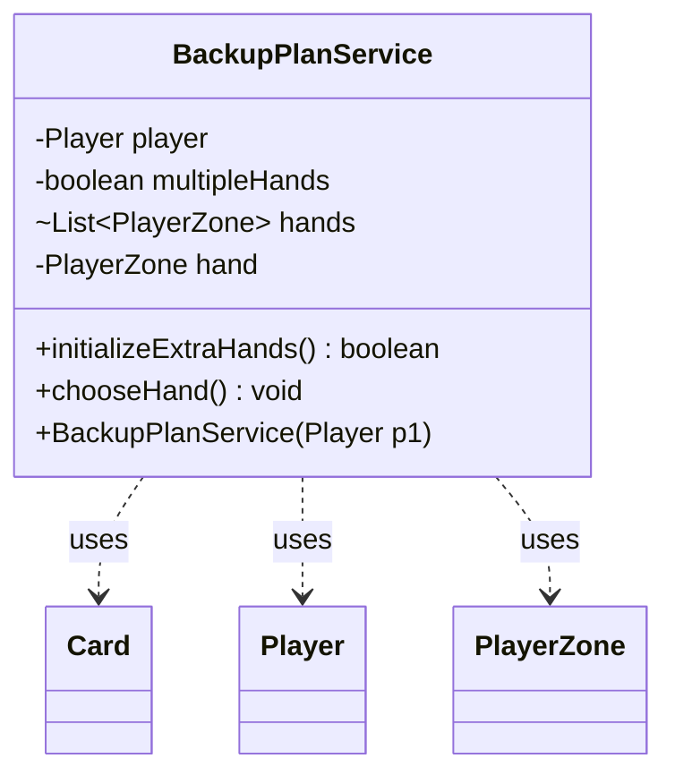

---
aliases:
  - BackupPlanService
tags:
  - java/class
  - module/forge-game
  - pkg/forge/game/extrahands
fqn: forge.game.extrahands.BackupPlanService
package: forge.game.extrahands
module: forge-game
kind: Class
---

# BackupPlanService

**Package:** `forge.game.extrahands` &nbsp; **Module:** `forge-game` &nbsp; **Kind:** Class



## Relationships
**Uses:**
- [[forge.game.card.Card|Card]]
- [[forge.game.player.Player|Player]]
- [[forge.game.zone.PlayerZone|PlayerZone]]

## Design Description

BackupPlanService encapsulates the rules for the "Backup Plan" conspiracy, which lets a player begin the game with several alternative opening hands. Constructed with a single `Player`, it acts as a stateless-per-game helper that operates on that player's zones rather than extending any supertype, keeping the multi-hand mulligan logic isolated from core game flow. `initializeExtraHands()` collects the standard hand plus any `ExtraHand` zones, drawing seven cards into each and reporting whether multiple hands exist; `chooseHand()` then delegates the selection to the player's controller and recycles the unchosen hands back into the library via the game's action system.

It collaborates with `Player` for zone access and drawing, `PlayerZone` to represent each candidate hand, and `Card` when moving cards between zones. The design favors a small, focused service with clear two-phase setup-then-choose semantics, and a code comment flags that UI rendering of the extra zones remains unimplemented.

## Source
`forge-game/src/main/java/forge/game/extrahands/BackupPlanService.java`

```java
package forge.game.extrahands;

import com.google.common.collect.Lists;
import forge.game.card.Card;
import forge.game.player.Player;
import forge.game.zone.PlayerZone;
import forge.game.zone.ZoneType;

import java.util.List;

public class BackupPlanService {
    private final Player player;
    private boolean multipleHands = false;
    List<PlayerZone> hands = Lists.newArrayList();
    private PlayerZone hand;

    public BackupPlanService(Player p1) {
        this.player = p1;
    }

    public boolean initializeExtraHands() {
        hand = player.getZone(ZoneType.Hand);
        hands.add(hand);

        // If pl has Backup Plan as a Conspiracy draw that many extra hands
        if (player.getExtraZones() == null) {
            return multipleHands;
        }
        for(PlayerZone extraHand : player.getExtraZones()) {
            if (extraHand.getZoneType() == ZoneType.ExtraHand) {
                player.drawCards(7, extraHand);
                multipleHands = true;
                hands.add(extraHand);
                // If we figure out how to render the zone in the UI, do it here
            }
        }

        player.updateZoneForView(hand);
        return multipleHands;
    }

    public void chooseHand() {
        if (!multipleHands) {
            return;
        }

        PlayerZone library = player.getZone(ZoneType.Library);
        // Choose one of the starting hands and recycle the rest
        PlayerZone startingHand = player.getController().chooseStartingHand(hands);
        if (startingHand == hand) {
            for(PlayerZone extraHand : player.getExtraZones()) {
                if (extraHand.getZoneType() == ZoneType.ExtraHand) {
                    for (Card c : Lists.newArrayList(extraHand.getCards().iterator())) {
                        player.getGame().getAction().moveTo(library, c, null);
                    }
                }
            }
        } else {
            for (Card c : Lists.newArrayList(hand.getCards().iterator())) {
                player.getGame().getAction().moveTo(library, c, null);
            }

            for(PlayerZone extraHand : player.getExtraZones()) {
                boolean starting = startingHand.equals(extraHand);
                for (Card c : Lists.newArrayList(extraHand.getCards().iterator())) {
                    if (starting) {
                        player.getGame().getAction().moveTo(hand, c, null);
                    } else {
                        player.getGame().getAction().moveTo(library, c, null);
                    }
                }
            }
        }

        player.resetExtraZones(ZoneType.ExtraHand);
        player.updateZoneForView(player.getZone(ZoneType.Hand));
    }
}
```
