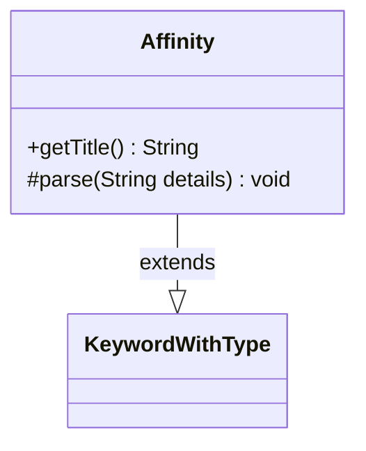

---
aliases:
  - Affinity
tags:
  - java/class
  - module/forge-game
  - pkg/forge/game/keyword
fqn: forge.game.keyword.Affinity
package: forge.game.keyword
module: forge-game
kind: Class
---

# Affinity

**Package:** `forge.game.keyword`   **Module:** `forge-game`   **Kind:** Class



## Relationships
**Extends:**
- [[forge.game.keyword.KeywordWithType|KeywordWithType]]

## Design Description

Affinity is a concrete keyword implementation in Forge's MTG engine that models Magic's "Affinity" cost-reduction ability, which lowers a spell's cost based on the number of qualifying permanents. Extending KeywordWithType, it inherits the framework for keywords parameterized by a card type and supplies the two pieces of behavior its supertype requires: getTitle() produces the human-readable label ("Affinity for …"), while parse() interprets the keyword's detail string to populate the inherited type, descType, and reminderType fields. The parse logic handles several recognized variants (generic affinity, Outlaw, Historic), a colon-delimited "type:description" form, and a default fallback that derives plural and reminder text via CardType and Lang utilities—centralizing the mapping from raw keyword data to the validity predicate and reminder text used elsewhere in the game.

## Source
`forge-game/src/main/java/forge/game/keyword/Affinity.java`

```java
package forge.game.keyword;

import java.util.Arrays;

import forge.card.CardType;
import forge.util.Lang;

public class Affinity extends KeywordWithType {

    @Override
    public String getTitle() {
        StringBuilder sb = new StringBuilder();
        sb.append("Affinity for ").append(descType);
        return sb.toString();
    }

    @Override
    protected void parse(String details) {
        if ("Affinity".equalsIgnoreCase(details)) {
            type = "Permanent.withAffinity";
            descType = "Affinity";
            reminderType = "permanent with affinity"; // technically the reminder says "permanent you control with affinity", but thats a TestCard
        } else if ("Outlaw".equalsIgnoreCase(details)) {
            type = "Permanent.Outlaw";
            descType = "outlaws";
            reminderType = Lang.getInstance().buildValidDesc(CardType.Constant.OUTLAW_TYPES, true);
        } else if ("Historic".equalsIgnoreCase(details)) {
            type = "Permanent.Historic";
            descType = "historic permanents";
            reminderType = "artifact, legendary, and/or Saga permanent";
        } else if (details.contains(":")) {
            String k[];
            k = details.split(":");
            type = k[0];
            descType = Lang.getPlural(k[1]);
            reminderType = k[1];
        } else {
            type = details;
            descType = CardType.getPluralType(type);
            reminderType = Lang.getInstance().buildValidDesc(Arrays.asList(type.split(",")), true);
        }
    }
}
```

## Python
`forge/game/keyword/Affinity.py`

```python
from forge.game.keyword.KeywordWithType import KeywordWithType
from forge.card.CardType import CardType
from forge.util.Lang import Lang
import typing


class Affinity(KeywordWithType):

    def getTitle(self) -> str:
        sb = []
        sb.append("Affinity for ")
        sb.append(self.descType)
        return "".join(sb)

    def parse(self, details: str) -> None:
        if "Affinity".lower() == details.lower():
            self.type = "Permanent.withAffinity"
            self.descType = "Affinity"
            self.reminderType = "permanent with affinity"  # technically the reminder says "permanent you control with affinity", but thats a TestCard
        elif "Outlaw".lower() == details.lower():
            self.type = "Permanent.Outlaw"
            self.descType = "outlaws"
            self.reminderType = Lang.getInstance().buildValidDesc(CardType.Constant.OUTLAW_TYPES, True)
        elif "Historic".lower() == details.lower():
            self.type = "Permanent.Historic"
            self.descType = "historic permanents"
            self.reminderType = "artifact, legendary, and/or Saga permanent"
        elif ":" in details:
            k = details.split(":")
            self.type = k[0]
            self.descType = Lang.getPlural(k[1])
            self.reminderType = k[1]
        else:
            self.type = details
            self.descType = CardType.getPluralType(self.type)
            self.reminderType = Lang.getInstance().buildValidDesc(self.type.split(","), True)
```
