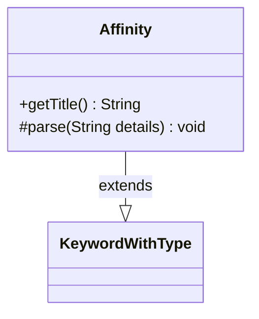

---
aliases:
  - Affinity
tags:
  - java/class
  - module/forge-game
  - pkg/forge/game/keyword
fqn: forge.game.keyword.Affinity
package: forge.game.keyword
module: forge-game
kind: Class
---

# Affinity

**Package:** `forge.game.keyword` &nbsp; **Module:** `forge-game` &nbsp; **Kind:** Class



## Relationships
**Extends:**
- [[forge.game.keyword.KeywordWithType|KeywordWithType]]

## Source
`forge-game/src/main/java/forge/game/keyword/Affinity.java`

```java
package forge.game.keyword;

import java.util.Arrays;

import forge.card.CardType;
import forge.util.Lang;

public class Affinity extends KeywordWithType {

    @Override
    public String getTitle() {
        StringBuilder sb = new StringBuilder();
        sb.append("Affinity for ").append(descType);
        return sb.toString();
    }

    @Override
    protected void parse(String details) {
        if ("Affinity".equalsIgnoreCase(details)) {
            type = "Permanent.withAffinity";
            descType = "Affinity";
            reminderType = "permanent with affinity"; // technically the reminder says "permanent you control with affinity", but thats a TestCard
        } else if ("Outlaw".equalsIgnoreCase(details)) {
            type = "Permanent.Outlaw";
            descType = "outlaws";
            reminderType = Lang.getInstance().buildValidDesc(CardType.Constant.OUTLAW_TYPES, true);
        } else if ("Historic".equalsIgnoreCase(details)) {
            type = "Permanent.Historic";
            descType = "historic permanents";
            reminderType = "artifact, legendary, and/or Saga permanent";
        } else if (details.contains(":")) {
            String k[];
            k = details.split(":");
            type = k[0];
            descType = Lang.getPlural(k[1]);
            reminderType = k[1];
        } else {
            type = details;
            descType = CardType.getPluralType(type);
            reminderType = Lang.getInstance().buildValidDesc(Arrays.asList(type.split(",")), true);
        }
    }
}
```
